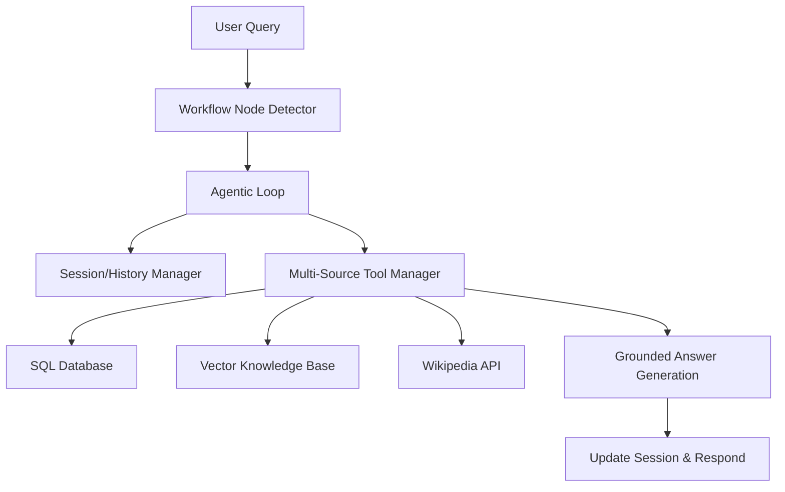

# Connexio Multi-Source RAG Agent V2

The V2 RAG Agent is a sophisticated, agentic advisor for the Connexio project collaboration platform. It transitions from basic vector search to a multi-source sistema capable of reasoning across structured SQL data, unstructured documentation, and general knowledge.

## Core Features

### 1. Agentic Loop & Node Routing

Every user query is routed through one of 5 specialized workflow nodes:

- **ONBOARDING**: Guidance for new users.
- **TEAM_FORMATION**: Intelligent teammate matching logic.
- **PHASE_TRANSITION**: Validating deliverables before project advancement.
- **BLOCKER**: Troubleshooting and technical problem resolution.
- **MILESTONE_WARNING**: Proactive reporting on deadlines and late tasks.
- **GENERAL**: Conversational AI grounded in project context.

### 2. Multi-Source Intelligence

The agent autonomously decides which tools to invoke based on the query:

- **SQL Database**: Fetches real-time project metrics, user skills, and task history.
- **Vector Knowledge Base**: Searches through project onboarding docs and community threads.
- **Wikipedia**: Falls back to external research for technical jargon and general definitions.

### 3. Specialized Tools

- **Matching Rationale**: Explains _"Why was I matched?"_ using the 6-factor algorithm (Skills, Availability, Rating, etc.).
- **Team Gap Analysis**: Identifies missing roles in a project team.
- **Portfolio Generator**: Automatically summarizes a user's contributions into a professional entry.
- **Task Architect**: Generates step-by-step resolution plans for complex technical problems.
- **Supervisor Risks**: Aggregates team progress data for educators and supervisors.

## Architecture

## API Endpoints

- `POST /api/v1/nlp/agent/chat`: The main conversation entry (Persona & Session aware).
- `POST /api/v1/nlp/agent/portfolio`: Generates resume content.
- `GET /api/v1/nlp/agent/supervisor/risks`: High-level team risk assessment.
- `GET /api/v1/nlp/agent/coach/path`: Skill growth recommendations.
- `POST /api/v1/nlp/agent/doc-gen`: Generates README or Retrospective docs.
- `POST /api/v1/nlp/agent/task-architect/plan`: Detailed resolution planning.

## Setup & Usage

1. **Environment Variables**: Ensure your `.env` contains the required Postgres and LLM configurations.
2. **Postman Testing**: A comprehensive Postman collection is available at `src/postman/collections/Connexio_Agent_V2.postman_collection.json`.
3. **Database**: The agent logic includes built-in mock handling for missing schemas to ensure immediate functionality while integrating with the backend.

---
