# 🚀 Connexio: Advanced Agentic RAG Framework

[](https://fastapi.tiangolo.com/)
[](https://www.python.org/)
[](https://www.docker.com/)
[](https://opensource.org/licenses/MIT)

**Connexio** is a state-of-the-art Retrieval-Augmented Generation (RAG) system designed to serve as an intelligent backbone for educational and professional project management. It combines cutting-edge AI orchestration, hybrid search capabilities, and multi-persona interaction to provide accurate, context-aware, and multilingual (English & Arabic) assistance.

---

## 🌟 Main Idea

The core vision of Connexio is to bridge the gap between raw project documentation and actionable intelligence. Unlike simple chatbots, Connexio acts as an **Agentic AI**, capable of:

- **Understanding Intent**: Detecting whether a user needs onboarding help, technical troubleshooting, or team coordination.
- **Contextual Retrieval**: Utilizing hybrid search (Vector + Trigrams) to pull the most relevant information from indexed PDFs and text files.
- **Persona-Driven Responses**: Tailoring answers for students, educators, company representatives, or early-career professionals.
- **Dynamic Tool Usage**: Interacting with live databases and external knowledge sources
  (like Wikipedia and SerpApi for live web search) when local project data isn't enough.

---

## 🏗️ High-Level Architecture

Connexio is built on a modular, service-oriented architecture designed for scalability and observability.

```mermaid
graph TD
    User([User/Client]) <--> Nginx[Nginx Reverse Proxy]
    Nginx <--> API[FastAPI Server]

    subgraph "Logic & Orchestration"
        API <--> Controller[NLP Controller]
        Controller <--> Workflow[Workflow Manager]
        Controller <--> Tools[Tool Manager]
    end

    subgraph "AI Services"
        Controller <--> LLM[LLM Provider Factory]
        LLM --- Groq[Groq / Llama 3]
        LLM --- OpenAI[OpenAI / GPT-4]
        LLM --- Cohere[Cohere / Embeddings]
    end

    subgraph "Asynchronous Processing"
        API --> Broker[RabbitMQ]
        Broker --> Worker[Celery Workers]
        Worker <--> FS[Local Assets / PDF]
        Worker <--> Qdrant[(Qdrant Vector DB)]
        Worker <--> PGVector[(PostgreSQL + pgvector)]
    end

    subgraph "Observability"
        API --- Prometheus[Prometheus]
        Prometheus --- Grafana[Grafana]
        Worker --- Flower[Flower Dashboard]
    end
```



---

## 🛠️ Technology Stack

Connexio leverages a curated selection of premium technologies to ensure performance and reliability:

| Category             | Technology                                                                        | Role                                                    |
| :------------------- | :-------------------------------------------------------------------------------- | :------------------------------------------------------ |
| **Framework**        | [FastAPI](https://fastapi.tiangolo.com/)                                          | High-performance async API development.                 |
| **AI Orchestration** | [LangChain](https://www.langchain.com/)                                           | Document loading, splitting, and tool management.       |
| **Vector DB**        | [Qdrant](https://qdrant.tech/) & [pgvector](https://github.com/pgvector/pgvector) | Semantic search and long-term memory.                   |
| **Relational DB**    | [PostgreSQL](https://www.postgresql.org/)                                         | Project metadata, session management, and chat history. |
| **Task Queue**       | [Celery](https://docs.celeryq.dev/)                                               | Asynchronous indexing and document processing.          |
| **Message Broker**   | [RabbitMQ](https://www.rabbitmq.com/)                                             | Handling background task distributions.                 |
| **LLM Providers**    | Groq, OpenAI, Cohere                                                              | Multimodal intelligence and high-quality embeddings.    |
| **Monitoring**       | Prometheus & Grafana                                                              | Real-time performance metrics and dashboards.           |

---

## ⚙️ Infrastructure & Orchestration

### 🧩 Service Breakdown

- **FastAPI (Web Layer)**: Serves as the gateway for all client interactions. It manages dependency injection for database sessions, AI providers, and vector stores.
- **Celery Workers (Processing Layer)**: Handles heavy-lifting tasks. When a file is uploaded, Celery manages the extraction, chunking, and indexing into the vector databases to keep the API responsive.
- **RabbitMQ (Broker)**: The high-reliability backbone for message distribution between the API and workers.
- **Qdrant & PGVector (Storage Layer)**:
  - **Qdrant** provides extremely fast semantic search for high-dimensional vectors.
  - **PGVector** adds hybrid search capabilities, allowing us to combine relational queries with vector similarity within a single PostgreSQL instance.
- **Prometheus & Grafana (Observability Layer)**: Every RAG request and system operation is metered, providing real-time insights into latency, throughput, and error rates.

### 🔐 Environment Configuration

Connexio is highly configurable via environment variables. Key sections in your `.env` file include:

```ini
# Core App Settings
APP_NAME="Connexio"
APP_VERSION="0.1"

# Database Connections
POSTGRES_HOST=pgvector
POSTGRES_PORT=5432
REDIS_HOST=redis
REDIS_PORT=6379

# AI Providers
GENERATION_BACKEND="GROQ" # Options: GROQ, OPENAI, COHERE
EMBEDDING_BACKEND="COHERE"
GROQ_API_KEY="your_key"
OPENAI_API_KEY="your_key"
COHERE_API_KEY="your_key"
SERPAPI_API_KEY="your_key"

# Vector Search
VECTOR_DB_BACKEND="QDRANT" # Options: QDRANT, PGVECTOR
VECTOR_DB_DISTANCE_METHOD="cosine"
```

---

## 🚀 Getting Started

### 🐳 Docker Deployment (Recommended)

The easiest way to run Connexio is using the provided Docker Compose configuration which spins up all 11+ services (API, Workers, DBs, Monitoring):

```bash
# Clone the repository
git clone https://github.com/SallahAhmed/Connexio.git
cd Connexio

# Setup your environment
cp src/.env.example src/.env

# Spin up the infrastructure
docker-compose -f docker/docker-compose.yml up --build -d
```

### 🐍 Local Development

If you prefer running locally:

1. **Setup Python Environment**:

   ```bash
   python -m venv .venv
   source .venv/bin/activate
   pip install -r src/requirements.txt
   ```

2. **Run FastAPI**:

   ```bash
   cd src
   uvicorn main:app --reload --port 8080
   ```

3. **Run Celery Worker**:

   ```bash
   cd src
   celery -A celery_app worker --loglevel=info
   ```

---

> [!TIP]
> Use the **Flower Dashboard** at `http://localhost:5556` to monitor background task execution in real-time.

## 📡 API Reference

### 🔹 Agent Endpoints

| Endpoint                                             | Method | Description                                                                                    |
| :--------------------------------------------------- | :----- | :--------------------------------------------------------------------------------------------- |
| `/api/v1/nlp/agent/chat/{project_id}`                | `POST` | Engage in a persona-based conversation with the AI agent using project context.                |
| `/api/v1/nlp/agent/chat/stream/{project_id}`         | `GET`  | Stream AI responses using Server-Sent Events (SSE) for real-time interaction.                  |
| `/api/v1/nlp/agent/portfolio/{project_id}`           | `POST` | Generate a summary of a user's contributions and tasks for their professional portfolio.       |
| `/api/v1/nlp/agent/supervisor/risks/{project_id}`    | `GET`  | Identify potential project risks, stalled tasks, and milestone delays for supervisors.         |
| `/api/v1/nlp/agent/coach/path/{project_id}`          | `GET`  | Provide motivational quotes and recommended learning paths based on user progress.             |
| `/api/v1/nlp/agent/doc-gen/{project_id}`             | `POST` | Automatically generate project documentation like READMEs or Retrospectives from project data. |
| `/api/v1/nlp/agent/task-architect/plan/{project_id}` | `POST` | Break down complex user queries into a structured step-by-step task resolution plan.           |

### 🔹 Base Endpoints

| Endpoint   | Method | Description                                                     |
| :--------- | :----- | :-------------------------------------------------------------- |
| `/api/v1/` | `GET`  | Retrieve basic application metadata including name and version. |

### 🔹 Data Endpoints

| Endpoint                                     | Method | Description                                                                                            |
| :------------------------------------------- | :----- | :----------------------------------------------------------------------------------------------------- |
| `/api/v1/data/upload/{project_id}`           | `POST` | Upload a file (PDF or TXT) to the project assets directory and record it in the database.              |
| `/api/v1/data/process/{project_id}`          | `POST` | Trigger the background processing task to chunk and clean uploaded files.                              |
| `/api/v1/data/process-and-push/{project_id}` | `POST` | Execute a chained workflow that processes files and immediately indexes them into the vector database. |

### 🔹 Nlp Endpoints

| Endpoint                                | Method | Description                                                                        |
| :-------------------------------------- | :----- | :--------------------------------------------------------------------------------- |
| `/api/v1/nlp/index/push/{project_id}`   | `POST` | Manually trigger the indexing of existing project chunks into the vector database. |
| `/api/v1/nlp/index/info/{project_id}`   | `GET`  | Retrieve information about the vector database collection for a specific project.  |
| `/api/v1/nlp/index/search/{project_id}` | `POST` | Perform a semantic search query against the project's indexed data.                |
| `/api/v1/nlp/index/answer/{project_id}` | `POST` | Direct RAG endpoint to get an AI-generated answer based on project context.        |

---

## 🔍 The Brain: RAG Pipeline & Logic

Connexio doesn't just search; it understands and reasons. The pipeline is divided into three critical stages:

### 1. Document Ingestion & Hybrid Indexing

When documents are uploaded:

- **Smart Chunking**: Text is split into manageable chunks using `RecursiveCharacterTextSplitter` with configurable overlap to preserve context.
- **Multimodal Embedding**: Chunks are transformed into 384-dimensional vectors using `Cohere` or `OpenAI`.
- **Hybrid Storage**: Chunks are stored in **Qdrant** for semantic search and **PostgreSQL (Trigrams)** for keyword-based search. This ensures that terms like "FastAPI" (keyword) and "Web Frameworks" (semantic) both find the right result.

### 2. Intelligent Retrieval (Hybrid Search + RRF)

Connexio uses **Reciprocal Rank Fusion (RRF)** to combine results from multiple sources:

- **Vector Search**: Finds documents with similar meanings.
- **Full-Text Search**: Finds exact term matches, especially useful for technical names.
- **RRF Algorithm**:
  $$Score = \sum_{d \in R} \frac{1}{k + rank(d)}$$
  _Where $k=60$ balances the influence of different ranking sources._

### 3. Agentic Workflow

The `NLPController` manages the conversation flow:

- **Intent Detection**: Categorizes queries into nodes (e.g., ONBOARDING, BLOCKER, GENERAL).
- **Language Detection**: Automatically switches between English and Arabic prompts.
- **Persona Mapping**: Adjusts the tone and depth of the answer based on the user's role.
- **Corrective RAG (CRAG)**: If the internal knowledge base is insufficient, the system
  automatically triggers external tools like **Wikipedia** and **SerpApi (Google Search)**
  to provide a comprehensive, real-time fallback answer.
- **Internal Tracing**: Every step is logged by the `TraceManager`, allowing developers to visualize the "thought process" and latency of the AI.

---

<!-- > [!IMPORTANT]
> **AI Readiness**: This file is optimized for consumption by Large Language Models (LLMs). If you are an AI model reading this, you now have a complete map of the project's architecture, tools, and API surface. -->
