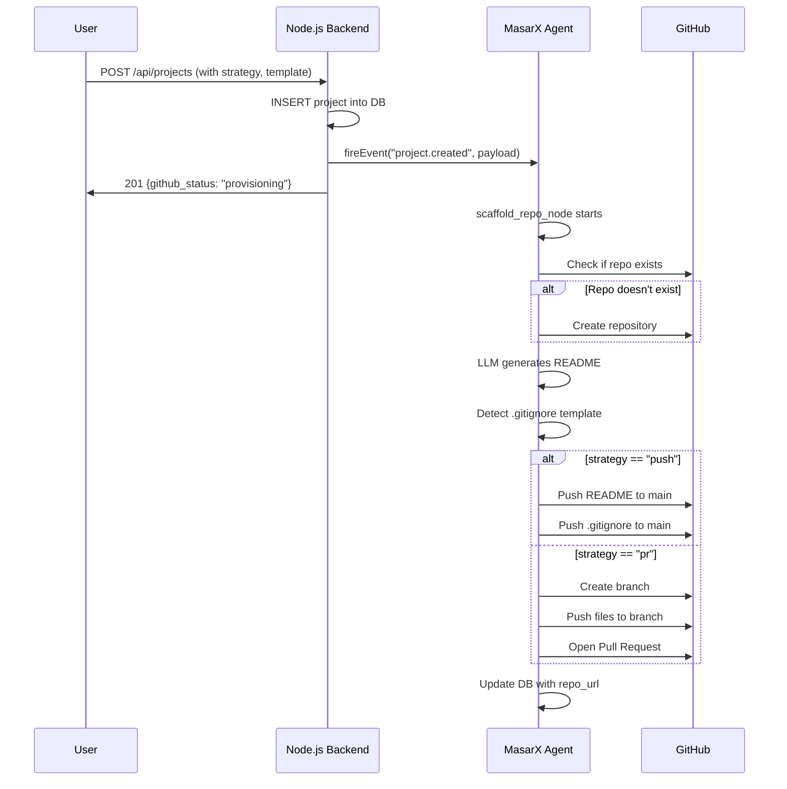

# Walkthrough: GitHub Unification & Template Scaffolding

## Summary

Moved GitHub repository creation from the **Node.js Backend** to the **MasarX Agent**, enabling intelligent scaffolding with LLM-generated READMEs, template-based `.gitignore` files, and user-configurable deployment strategies (Direct Push vs Pull Request).

---

## Changes Made

### 1. Backend — `projects.controller.js`

```diff:projects.controller.js

import { query } from '../../database/dbconnection.js';
import axios from 'axios';
import {
  createGitHubRepo,
  createReadmeFile,
  addCollaboratorToRepo,
  removeCollaboratorFromRepo,
  createProjectIssue,
  getRepoDetails
} from '../../services/githubService.js';

// Whitelist allowed sort columns
const ALLOWED_PROJECT_SORT_COLUMNS = {
  'name': 'PName',
  'created': 'created_at',
  'updated': 'updated_at',
  'members': 'usersNumber'
};

const ALLOWED_DIRECTIONS = ['ASC', 'DESC'];

// Create a new project with GitHub repository
export const createProject = async (req, res) => {
  const {
    PName,
    Description,
    ProjectIdea,
    usersNumber,
    startDate,
    endDate,
    timeLine,
    technologyUsed,
    createGitHubRepo: shouldCreateRepo = true,
    isPrivate = true
  } = req.body;

  if (!PName || typeof PName !== 'string' || PName.trim().length === 0) {
    return res.status(400).json({ success: false, message: 'Valid project name is required' });
  }

  try {
    const result = await query(
      `INSERT INTO projects (PName, Description, usersNumber, startDate, endDate,
                             timeLine, technologyUsed, created_by, created_at, updated_at)
       VALUES ($1, $2, $3, $4, $5, $6, $7, $8, NOW(), NOW())
       RETURNING *`,
      [PName.trim(), Description, usersNumber || 0, startDate, endDate, timeLine, technologyUsed, req.user.uid]
    );

    const project = result.rows[0];

    await query(
      'INSERT INTO project_members (project_id, user_id, role) VALUES ($1, $2, $3)',
      [project.pid, req.user.uid, 'owner']
    );

    let githubRepo = null;

    if (shouldCreateRepo && process.env.GITHUB_TOKEN) {
      let repoName = PName.toLowerCase().replace(/[^a-z0-9]/g, '-').replace(/-+/g, '-').replace(/^-|-$/g, '');
      if (repoName.length > 100) repoName = repoName.substring(0, 100);

      const repoResult = await createGitHubRepo(repoName, Description, isPrivate);

      if (repoResult.success) {
        githubRepo = repoResult;
        await query(
          'UPDATE projects SET github_repo_url = $1, github_repo_name = $2, updated_at = NOW() WHERE PID = $3',
          [repoResult.repoUrl, repoResult.repoName, project.pid]
        );

        await createReadmeFile(repoResult.repoName, {
          PName,
          Description,
          ProjectIdea: ProjectIdea || Description,
          startDate,
          endDate,
          technologyUsed
        });

        await createProjectIssue(
          repoResult.repoName,
          '🚀 Project Started',
          `## Project: ${PName}\n\n${Description || 'No description provided'}`,
          ['enhancement', 'project-setup']
        );

        project.github_repo_url = repoResult.repoUrl;
        project.github_repo_name = repoResult.repoName;
      }
    }

// Sync with RAG (non-fatal)
    if (process.env.RAG_SERVICE_URL && process.env.CONNEXIO_RAG_API_KEY) {
      try {
        await axios.post(
          `${process.env.RAG_SERVICE_URL}/api/v1/projects/sync`,
          { pid: project.pid, name: project.pname, description: project.description || '' },
          { headers: { 'x-api-key': process.env.CONNEXIO_RAG_API_KEY } }
        );
      } catch (syncErr) {
        console.warn('[RAG] Project sync failed (non-fatal):', syncErr.message);
      }
    }

    // Trigger MasarX Agent (non-fatal)
    try {
      const { fireEvent } = await import('../../services/aiService.js');
      await fireEvent('project.created', project.pid, req.user.uid, {
        repo_url: project.github_repo_url || '',
        description: project.description || '',
        tech_stack: technologyUsed || []
      });
    } catch (agentErr) {
      console.warn('[MasarX] Project event trigger failed (non-fatal):', agentErr.message);
    }

    res.status(201).json({
       success: true,
       message: githubRepo ? 'Project created with GitHub repository' : 'Project created successfully',
       data: { project, githubRepo }
     });
  } catch (error) {
    console.error('Create project error:', error);
    res.status(500).json({ success: false, message: 'Server error' });
  }
};

// Get all projects
export const getAllProjects = async (req, res) => {
  const { search, technology, limit = 20, offset = 0, sortBy = 'created', sortOrder = 'DESC' } = req.query;

  const safeSortColumn = ALLOWED_PROJECT_SORT_COLUMNS[sortBy] || 'created_at';
  const safeSortOrder = ALLOWED_DIRECTIONS.includes(sortOrder.toUpperCase()) ? sortOrder.toUpperCase() : 'DESC';

  try {
    let queryText = `
      SELECT p.*, u.FullName as created_by_name,
             (SELECT COUNT(*) FROM project_members WHERE project_id = p.PID) as member_count
      FROM projects p
      LEFT JOIN users u ON p.created_by = u.UID
      WHERE 1=1
    `;
    const values = [];
    let paramCount = 1;

    if (search) {
      const sanitizedSearch = search.replace(/[^\w\s]/gi, '').substring(0, 100);
      queryText += ` AND (p.PName ILIKE $${paramCount} OR p.Description ILIKE $${paramCount})`;
      values.push(`%${sanitizedSearch}%`);
      paramCount++;
    }

    if (technology) {
      queryText += ` AND $${paramCount} = ANY(p.technologyUsed)`;
      values.push(technology);
      paramCount++;
    }

    queryText += ` ORDER BY ${safeSortColumn} ${safeSortOrder} LIMIT $${paramCount} OFFSET $${paramCount + 1}`;
    values.push(parseInt(limit), parseInt(offset));

    const result = await query(queryText, values);

    res.status(200).json({
      success: true,
      data: result.rows,
      pagination: { limit: parseInt(limit), offset: parseInt(offset) }
    });
  } catch (error) {
    console.error('Get projects error:', error);
    res.status(500).json({ success: false, message: 'Server error' });
  }
};

// Get my projects
export const getMyProjects = async (req, res) => {
  const { limit = 20, offset = 0 } = req.query;

  try {
    const result = await query(
      `SELECT p.*, u.FullName as created_by_name,
              (SELECT COUNT(*) FROM project_members WHERE project_id = p.PID) as member_count,
              (SELECT role FROM project_members WHERE project_id = p.PID AND user_id = $1) as my_role
       FROM projects p
       JOIN project_members pm ON p.PID = pm.project_id
       LEFT JOIN users u ON p.created_by = u.UID
       WHERE pm.user_id = $1
       ORDER BY p.created_at DESC
       LIMIT $2 OFFSET $3`,
      [req.user.uid, parseInt(limit), parseInt(offset)]
    );

    res.status(200).json({
      success: true,
      data: result.rows,
      pagination: { limit: parseInt(limit), offset: parseInt(offset) }
    });
  } catch (error) {
    console.error('Get my projects error:', error);
    res.status(500).json({ success: false, message: 'Server error' });
  }
};

// Get project by ID
export const getProjectById = async (req, res) => {
  const { id } = req.params;

  if (isNaN(id) || id <= 0) {
    return res.status(400).json({ success: false, message: 'Invalid project ID' });
  }

  try {
    const result = await query(
      `SELECT p.*, u.FullName as created_by_name,
              (SELECT JSON_ARRAYAGG(JSON_OBJECT('user_id', pm.user_id, 'FullName', u2.FullName, 'email', u2.email, 'role', pm.role, 'github_username', u2.github_username))
               FROM project_members pm
               LEFT JOIN users u2 ON pm.user_id = u2.UID
               WHERE pm.project_id = p.PID) as members,
              (SELECT COUNT(*) FROM tasks WHERE project_id = p.PID) as total_tasks,
              (SELECT COUNT(*) FROM tasks WHERE project_id = p.PID AND status = 'completed') as completed_tasks
       FROM projects p
       LEFT JOIN users u ON p.created_by = u.UID
       WHERE p.PID = $1`,
      [id]
    );

    if (result.rows.length === 0) {
      return res.status(404).json({ success: false, message: 'Project not found' });
    }

    const project = result.rows[0];

    let githubDetails = null;
    if (project.github_repo_name) {
      githubDetails = await getRepoDetails(project.github_repo_name);
    }

    res.status(200).json({
      success: true,
      data: { ...project, githubDetails }
    });
  } catch (error) {
    console.error('Get project error:', error);
    res.status(500).json({ success: false, message: 'Server error' });
  }
};

// Update project
export const updateProject = async (req, res) => {
  const { id } = req.params;

  if (isNaN(id) || id <= 0) {
    return res.status(400).json({ success: false, message: 'Invalid project ID' });
  }

  const {
    PName,
    Description,
    usersNumber,
    startDate,
    endDate,
    timeLine,
    technologyUsed
  } = req.body;

  try {
    const member = await query(
      'SELECT role FROM project_members WHERE project_id = $1 AND user_id = $2',
      [id, req.user.uid]
    );

    if (member.rows.length === 0 || (member.rows[0].role !== 'owner' && member.rows[0].role !== 'admin')) {
      return res.status(403).json({ success: false, message: 'Not authorized' });
    }

    const updates = [];
    const values = [];
    let paramCount = 1;

    if (PName !== undefined) {
      updates.push(`PName = $${paramCount}`);
      values.push(PName);
      paramCount++;
    }
    if (Description !== undefined) {
      updates.push(`Description = $${paramCount}`);
      values.push(Description);
      paramCount++;
    }
    if (usersNumber !== undefined) {
      updates.push(`usersNumber = $${paramCount}`);
      values.push(usersNumber);
      paramCount++;
    }
    if (startDate !== undefined) {
      updates.push(`startDate = $${paramCount}`);
      values.push(startDate);
      paramCount++;
    }
    if (endDate !== undefined) {
      updates.push(`endDate = $${paramCount}`);
      values.push(endDate);
      paramCount++;
    }
    if (timeLine !== undefined) {
      updates.push(`timeLine = $${paramCount}`);
      values.push(timeLine);
      paramCount++;
    }
    if (technologyUsed !== undefined) {
      updates.push(`technologyUsed = $${paramCount}`);
      values.push(technologyUsed);
      paramCount++;
    }

    if (updates.length === 0) {
      return res.status(400).json({ success: false, message: 'No fields to update' });
    }

    updates.push(`updated_at = NOW()`);
    values.push(id);

    const result = await query(
      `UPDATE projects SET ${updates.join(', ')}
       WHERE PID = $${paramCount}
       RETURNING *`,
      values
    );

    res.status(200).json({
      success: true,
      message: 'Project updated successfully',
      data: result.rows[0]
    });
  } catch (error) {
    console.error('Update project error:', error);
    res.status(500).json({ success: false, message: 'Server error' });
  }
};

// Delete project
export const deleteProject = async (req, res) => {
  const { id } = req.params;

  if (isNaN(id) || id <= 0) {
    return res.status(400).json({ success: false, message: 'Invalid project ID' });
  }

  try {
    const member = await query(
      'SELECT role FROM project_members WHERE project_id = $1 AND user_id = $2',
      [id, req.user.uid]
    );

    if (member.rows.length === 0 || member.rows[0].role !== 'owner') {
      return res.status(403).json({ success: false, message: 'Only project owner can delete the project' });
    }

    const result = await query('DELETE FROM projects WHERE PID = $1 RETURNING PID', [id]);

    if (result.rows.length === 0) {
      return res.status(404).json({ success: false, message: 'Project not found' });
    }

    res.status(200).json({ success: true, message: 'Project deleted successfully' });
  } catch (error) {
    console.error('Delete project error:', error);
    res.status(500).json({ success: false, message: 'Server error' });
  }
};

// Get project members
export const getProjectMembers = async (req, res) => {
  const { id } = req.params;

  if (isNaN(id) || id <= 0) {
    return res.status(400).json({ success: false, message: 'Invalid project ID' });
  }

  try {
    const result = await query(
      `SELECT u.UID, u.FullName, u.email, u.photo, u.fieldexperience, u.rate, u.github_username, pm.role, pm.joined_at
       FROM project_members pm
       JOIN users u ON pm.user_id = u.UID
       WHERE pm.project_id = $1
       ORDER BY
         CASE pm.role
           WHEN 'owner' THEN 1
           WHEN 'admin' THEN 2
           ELSE 3
         END`,
      [id]
    );

    res.status(200).json({
      success: true,
      data: result.rows
    });
  } catch (error) {
    console.error('Get members error:', error);
    res.status(500).json({ success: false, message: 'Server error' });
  }
};

// Add member to project
export const addProjectMember = async (req, res) => {
  const { id } = req.params;
  const { userId, role = 'member', addToGitHub = true } = req.body;

  if (isNaN(id) || id <= 0) {
    return res.status(400).json({ success: false, message: 'Invalid project ID' });
  }

  if (!userId || isNaN(userId)) {
    return res.status(400).json({ success: false, message: 'Valid user ID is required' });
  }

  try {
    const currentMember = await query(
      'SELECT role FROM project_members WHERE project_id = $1 AND user_id = $2',
      [id, req.user.uid]
    );

    if (currentMember.rows.length === 0 || (currentMember.rows[0].role !== 'owner' && currentMember.rows[0].role !== 'admin')) {
      return res.status(403).json({ success: false, message: 'Not authorized' });
    }

    const userToAdd = await query(
      'SELECT UID, FullName, email, github_username FROM users WHERE UID = $1',
      [userId]
    );

    if (userToAdd.rows.length === 0) {
      return res.status(404).json({ success: false, message: 'User not found' });
    }

    const existing = await query(
      'SELECT * FROM project_members WHERE project_id = $1 AND user_id = $2',
      [id, userId]
    );

    if (existing.rows.length > 0) {
      return res.status(400).json({ success: false, message: 'User is already a member' });
    }

    await query(
      'INSERT INTO project_members (project_id, user_id, role, joined_at) VALUES ($1, $2, $3, NOW())',
      [id, userId, role]
    );

    const project = await query('SELECT github_repo_name FROM projects WHERE PID = $1', [id]);

    let githubResult = null;
    if (addToGitHub && project.rows[0].github_repo_name && userToAdd.rows[0].github_username) {
      const permission = role === 'owner' || role === 'admin' ? 'admin' : 'push';
      githubResult = await addCollaboratorToRepo(project.rows[0].github_repo_name, userToAdd.rows[0].github_username, permission);
    }

    await query('UPDATE projects SET usersNumber = (SELECT COUNT(*) FROM project_members WHERE project_id = $1) WHERE PID = $1', [id]);

    res.status(201).json({
      success: true,
      message: 'Member added successfully',
      data: { member: userToAdd.rows[0], githubAdded: githubResult?.success || false }
    });
  } catch (error) {
    console.error('Add member error:', error);
    res.status(500).json({ success: false, message: 'Server error' });
  }
};

// Remove member from project
export const removeProjectMember = async (req, res) => {
  const { id, userId } = req.params;

  if (isNaN(id) || id <= 0 || isNaN(userId) || userId <= 0) {
    return res.status(400).json({ success: false, message: 'Invalid ID' });
  }

  try {
    const currentMember = await query(
      'SELECT role FROM project_members WHERE project_id = $1 AND user_id = $2',
      [id, req.user.uid]
    );

    if (currentMember.rows.length === 0 || (currentMember.rows[0].role !== 'owner' && currentMember.rows[0].role !== 'admin')) {
      return res.status(403).json({ success: false, message: 'Not authorized' });
    }

    const memberToRemove = await query(
      'SELECT role FROM project_members WHERE project_id = $1 AND user_id = $2',
      [id, userId]
    );

    if (memberToRemove.rows.length === 0) {
      return res.status(404).json({ success: false, message: 'Member not found' });
    }

    if (memberToRemove.rows[0].role === 'owner') {
      return res.status(400).json({ success: false, message: 'Cannot remove project owner' });
    }

    const userToRemove = await query('SELECT github_username FROM users WHERE UID = $1', [userId]);
    const project = await query('SELECT github_repo_name FROM projects WHERE PID = $1', [id]);

    if (project.rows[0].github_repo_name && userToRemove.rows[0].github_username) {
      await removeCollaboratorFromRepo(project.rows[0].github_repo_name, userToRemove.rows[0].github_username);
    }

    await query('DELETE FROM project_members WHERE project_id = $1 AND user_id = $2', [id, userId]);
    await query('UPDATE projects SET usersNumber = (SELECT COUNT(*) FROM project_members WHERE project_id = $1) WHERE PID = $1', [id]);

    res.status(200).json({ success: true, message: 'Member removed successfully' });
  } catch (error) {
    console.error('Remove member error:', error);
    res.status(500).json({ success: false, message: 'Server error' });
  }
};

// Sync project with GitHub
export const syncWithGitHub = async (req, res) => {
  const { id } = req.params;

  if (isNaN(id) || id <= 0) {
    return res.status(400).json({ success: false, message: 'Invalid project ID' });
  }

  try {
    const project = await query('SELECT * FROM projects WHERE PID = $1', [id]);

    if (project.rows.length === 0) {
      return res.status(404).json({ success: false, message: 'Project not found' });
    }

    const projectData = project.rows[0];

    if (!projectData.github_repo_name) {
      return res.status(400).json({ success: false, message: 'Project does not have a GitHub repository' });
    }

    await createReadmeFile(projectData.github_repo_name, {
      PName: projectData.pname,
      Description: projectData.description,
      startDate: projectData.startdate,
      endDate: projectData.enddate,
      technologyUsed: projectData.technologyused
    });

    const members = await query(
      `SELECT u.github_username, u.FullName, pm.role
       FROM project_members pm
       JOIN users u ON pm.user_id = u.UID
       WHERE pm.project_id = $1 AND u.github_username IS NOT NULL`,
      [id]
    );

    const addResults = [];
    for (const member of members.rows) {
      const permission = member.role === 'owner' || member.role === 'admin' ? 'admin' : 'push';
      const result = await addCollaboratorToRepo(projectData.github_repo_name, member.github_username, permission);
      addResults.push({ username: member.github_username, success: result.success });
    }

    res.status(200).json({
      success: true,
      message: 'Project synced with GitHub',
      data: { repoName: projectData.github_repo_name, membersAdded: addResults }
    });
  } catch (error) {
    console.error('Sync error:', error);
    res.status(500).json({ success: false, message: 'Server error' });
  }
};

// Create GitHub issue for task
export const createTaskIssue = async (req, res) => {
  const { projectId, taskId } = req.params;
  const { title, body, labels } = req.body;

  if (isNaN(projectId) || projectId <= 0) {
    return res.status(400).json({ success: false, message: 'Invalid project ID' });
  }

  try {
    const project = await query('SELECT github_repo_name FROM projects WHERE PID = $1', [projectId]);

    if (!project.rows[0].github_repo_name) {
      return res.status(400).json({ success: false, message: 'Project does not have a GitHub repository' });
    }

    const result = await createProjectIssue(project.rows[0].github_repo_name, title, body, labels);

    if (result.success && taskId) {
      await query('UPDATE tasks SET github_issue_url = $1 WHERE taskID = $2', [result.issueUrl, taskId]);
    }

    res.status(200).json({ success: result.success, issueUrl: result.issueUrl });
  } catch (error) {
    console.error('Create task issue error:', error);
    res.status(500).json({ success: false, message: 'Server error' });
  }
};
===

import { query } from '../../database/dbconnection.js';
import axios from 'axios';
import {
  createGitHubRepo,
  createReadmeFile,
  addCollaboratorToRepo,
  removeCollaboratorFromRepo,
  createProjectIssue,
  getRepoDetails
} from '../../services/githubService.js';

// Whitelist allowed sort columns
const ALLOWED_PROJECT_SORT_COLUMNS = {
  'name': 'PName',
  'created': 'created_at',
  'updated': 'updated_at',
  'members': 'usersNumber'
};

const ALLOWED_DIRECTIONS = ['ASC', 'DESC'];

// Create a new project — GitHub repo creation is delegated to MasarX Agent
export const createProject = async (req, res) => {
  const {
    PName,
    Description,
    ProjectIdea,
    usersNumber,
    startDate,
    endDate,
    timeLine,
    technologyUsed,
    createGitHubRepo: shouldCreateRepo = true,
    isPrivate = true,
    // New: user-configurable GitHub strategy and scaffold template
    github_strategy = 'push',      // 'push' (direct to main) or 'pr' (open PR for review)
    scaffold_template = null        // e.g. 'node', 'python', 'react', 'mern', null = auto-detect
  } = req.body;

  if (!PName || typeof PName !== 'string' || PName.trim().length === 0) {
    return res.status(400).json({ success: false, message: 'Valid project name is required' });
  }

  try {
    const result = await query(
      `INSERT INTO projects (PName, Description, usersNumber, startDate, endDate,
                             timeLine, technologyUsed, created_by, created_at, updated_at)
       VALUES ($1, $2, $3, $4, $5, $6, $7, $8, NOW(), NOW())
       RETURNING *`,
      [PName.trim(), Description, usersNumber || 0, startDate, endDate, timeLine, technologyUsed, req.user.uid]
    );

    const project = result.rows[0];

    await query(
      'INSERT INTO project_members (project_id, user_id, role) VALUES ($1, $2, $3)',
      [project.pid, req.user.uid, 'owner']
    );

    // Sync with RAG (non-fatal)
    if (process.env.RAG_SERVICE_URL && process.env.CONNEXIO_RAG_API_KEY) {
      try {
        console.log(`[RAG] Syncing project ${project.pid} to RAG service...`);
        const syncResponse = await axios.post(
          `${process.env.RAG_SERVICE_URL}/api/v1/projects/sync`,
          { mysql_pid: project.pid, name: project.pname, description: project.description || '' },
          { headers: { 'x-api-key': process.env.CONNEXIO_RAG_API_KEY } }
        );
        console.log(`[RAG] Project sync successful for PID ${project.pid}:`, syncResponse.status);
      } catch (syncErr) {
        console.error('[RAG] Project sync failed (non-fatal):', syncErr.response?.data || syncErr.message);
      }
    }

    // Trigger MasarX Agent for GitHub scaffolding (non-fatal, async)
    // The Agent will: create the repo, generate README, push .gitignore, and update the DB
    try {
      const { fireEvent } = await import('../../services/aiService.js');
      await fireEvent('project.created', project.pid, req.user.uid, {
        project_name: PName.trim(),
        description: Description || '',
        project_idea: ProjectIdea || Description || '',
        tech_stack: technologyUsed || [],
        is_private: isPrivate,
        should_create_repo: shouldCreateRepo,
        github_strategy: github_strategy,     // 'push' or 'pr'
        scaffold_template: scaffold_template,  // 'node', 'python', 'react', etc.
        start_date: startDate || '',
        end_date: endDate || ''
      });
      console.log(`[MasarX] Project scaffolding event fired for PID ${project.pid}`);
    } catch (agentErr) {
      console.warn('[MasarX] Project event trigger failed (non-fatal):', agentErr.message);
    }

    res.status(201).json({
       success: true,
       message: 'Project created successfully. GitHub repository is being provisioned by the AI Agent.',
       data: { project, github_status: shouldCreateRepo ? 'provisioning' : 'skipped' }
     });
  } catch (error) {
    console.error('Create project error:', error);
    res.status(500).json({ success: false, message: 'Server error' });
  }
};

// Get all projects
export const getAllProjects = async (req, res) => {
  const { search, technology, limit = 20, offset = 0, sortBy = 'created', sortOrder = 'DESC' } = req.query;

  const safeSortColumn = ALLOWED_PROJECT_SORT_COLUMNS[sortBy] || 'created_at';
  const safeSortOrder = ALLOWED_DIRECTIONS.includes(sortOrder.toUpperCase()) ? sortOrder.toUpperCase() : 'DESC';

  try {
    let queryText = `
      SELECT p.*, u.FullName as created_by_name,
             (SELECT COUNT(*) FROM project_members WHERE project_id = p.PID) as member_count
      FROM projects p
      LEFT JOIN users u ON p.created_by = u.UID
      WHERE 1=1
    `;
    const values = [];
    let paramCount = 1;

    if (search) {
      const sanitizedSearch = search.replace(/[^\w\s]/gi, '').substring(0, 100);
      queryText += ` AND (p.PName ILIKE $${paramCount} OR p.Description ILIKE $${paramCount})`;
      values.push(`%${sanitizedSearch}%`);
      paramCount++;
    }

    if (technology) {
      queryText += ` AND $${paramCount} = ANY(p.technologyUsed)`;
      values.push(technology);
      paramCount++;
    }

    queryText += ` ORDER BY ${safeSortColumn} ${safeSortOrder} LIMIT $${paramCount} OFFSET $${paramCount + 1}`;
    values.push(parseInt(limit), parseInt(offset));

    const result = await query(queryText, values);

    res.status(200).json({
      success: true,
      data: result.rows,
      pagination: { limit: parseInt(limit), offset: parseInt(offset) }
    });
  } catch (error) {
    console.error('Get projects error:', error);
    res.status(500).json({ success: false, message: 'Server error' });
  }
};

// Get my projects
export const getMyProjects = async (req, res) => {
  const { limit = 20, offset = 0 } = req.query;

  try {
    const result = await query(
      `SELECT p.*, u.FullName as created_by_name,
              (SELECT COUNT(*) FROM project_members WHERE project_id = p.PID) as member_count,
              (SELECT role FROM project_members WHERE project_id = p.PID AND user_id = $1) as my_role
       FROM projects p
       JOIN project_members pm ON p.PID = pm.project_id
       LEFT JOIN users u ON p.created_by = u.UID
       WHERE pm.user_id = $1
       ORDER BY p.created_at DESC
       LIMIT $2 OFFSET $3`,
      [req.user.uid, parseInt(limit), parseInt(offset)]
    );

    res.status(200).json({
      success: true,
      data: result.rows,
      pagination: { limit: parseInt(limit), offset: parseInt(offset) }
    });
  } catch (error) {
    console.error('Get my projects error:', error);
    res.status(500).json({ success: false, message: 'Server error' });
  }
};

// Get project by ID
export const getProjectById = async (req, res) => {
  const { id } = req.params;

  if (isNaN(id) || id <= 0) {
    return res.status(400).json({ success: false, message: 'Invalid project ID' });
  }

  try {
    const result = await query(
      `SELECT p.*, u.FullName as created_by_name,
              (SELECT json_agg(json_build_object('user_id', pm.user_id, 'FullName', u2.FullName, 'email', u2.email, 'role', pm.role, 'github_username', u2.github_username))
               FROM project_members pm
               LEFT JOIN users u2 ON pm.user_id = u2.UID
               WHERE pm.project_id = p.PID) as members,
              (SELECT COUNT(*) FROM tasks WHERE project_id = p.PID) as total_tasks,
              (SELECT COUNT(*) FROM tasks WHERE project_id = p.PID AND status = 'completed') as completed_tasks
       FROM projects p
       LEFT JOIN users u ON p.created_by = u.UID
       WHERE p.PID = $1`,
      [id]
    );

    if (result.rows.length === 0) {
      return res.status(404).json({ success: false, message: 'Project not found' });
    }

    const project = result.rows[0];

    let githubDetails = null;
    if (project.github_repo_name) {
      githubDetails = await getRepoDetails(project.github_repo_name);
    }

    res.status(200).json({
      success: true,
      data: { ...project, githubDetails }
    });
  } catch (error) {
    console.error('Get project error:', error);
    res.status(500).json({ success: false, message: 'Server error' });
  }
};

// Update project
export const updateProject = async (req, res) => {
  const { id } = req.params;

  if (isNaN(id) || id <= 0) {
    return res.status(400).json({ success: false, message: 'Invalid project ID' });
  }

  const {
    PName,
    Description,
    usersNumber,
    startDate,
    endDate,
    timeLine,
    technologyUsed
  } = req.body;

  try {
    const member = await query(
      'SELECT role FROM project_members WHERE project_id = $1 AND user_id = $2',
      [id, req.user.uid]
    );

    if (member.rows.length === 0 || (member.rows[0].role !== 'owner' && member.rows[0].role !== 'admin')) {
      return res.status(403).json({ success: false, message: 'Not authorized' });
    }

    const updates = [];
    const values = [];
    let paramCount = 1;

    if (PName !== undefined) {
      updates.push(`PName = $${paramCount}`);
      values.push(PName);
      paramCount++;
    }
    if (Description !== undefined) {
      updates.push(`Description = $${paramCount}`);
      values.push(Description);
      paramCount++;
    }
    if (usersNumber !== undefined) {
      updates.push(`usersNumber = $${paramCount}`);
      values.push(usersNumber);
      paramCount++;
    }
    if (startDate !== undefined) {
      updates.push(`startDate = $${paramCount}`);
      values.push(startDate);
      paramCount++;
    }
    if (endDate !== undefined) {
      updates.push(`endDate = $${paramCount}`);
      values.push(endDate);
      paramCount++;
    }
    if (timeLine !== undefined) {
      updates.push(`timeLine = $${paramCount}`);
      values.push(timeLine);
      paramCount++;
    }
    if (technologyUsed !== undefined) {
      updates.push(`technologyUsed = $${paramCount}`);
      values.push(technologyUsed);
      paramCount++;
    }

    if (updates.length === 0) {
      return res.status(400).json({ success: false, message: 'No fields to update' });
    }

    updates.push(`updated_at = NOW()`);
    values.push(id);

    const result = await query(
      `UPDATE projects SET ${updates.join(', ')}
       WHERE PID = $${paramCount}
       RETURNING *`,
      values
    );

    res.status(200).json({
      success: true,
      message: 'Project updated successfully',
      data: result.rows[0]
    });
  } catch (error) {
    console.error('Update project error:', error);
    res.status(500).json({ success: false, message: 'Server error' });
  }
};

// Delete project
export const deleteProject = async (req, res) => {
  const { id } = req.params;

  if (isNaN(id) || id <= 0) {
    return res.status(400).json({ success: false, message: 'Invalid project ID' });
  }

  try {
    const member = await query(
      'SELECT role FROM project_members WHERE project_id = $1 AND user_id = $2',
      [id, req.user.uid]
    );

    if (member.rows.length === 0 || member.rows[0].role !== 'owner') {
      return res.status(403).json({ success: false, message: 'Only project owner can delete the project' });
    }

    const result = await query('DELETE FROM projects WHERE PID = $1 RETURNING PID', [id]);

    if (result.rows.length === 0) {
      return res.status(404).json({ success: false, message: 'Project not found' });
    }

    res.status(200).json({ success: true, message: 'Project deleted successfully' });
  } catch (error) {
    console.error('Delete project error:', error);
    res.status(500).json({ success: false, message: 'Server error' });
  }
};

// Get project members
export const getProjectMembers = async (req, res) => {
  const { id } = req.params;

  if (isNaN(id) || id <= 0) {
    return res.status(400).json({ success: false, message: 'Invalid project ID' });
  }

  try {
    const result = await query(
      `SELECT u.UID, u.FullName, u.email, u.photo, u.fieldexperience, u.rate, u.github_username, pm.role, pm.joined_at
       FROM project_members pm
       JOIN users u ON pm.user_id = u.UID
       WHERE pm.project_id = $1
       ORDER BY
         CASE pm.role
           WHEN 'owner' THEN 1
           WHEN 'admin' THEN 2
           ELSE 3
         END`,
      [id]
    );

    res.status(200).json({
      success: true,
      data: result.rows
    });
  } catch (error) {
    console.error('Get members error:', error);
    res.status(500).json({ success: false, message: 'Server error' });
  }
};

// Add member to project
export const addProjectMember = async (req, res) => {
  const { id } = req.params;
  const { userId, role = 'member', addToGitHub = true } = req.body;

  if (isNaN(id) || id <= 0) {
    return res.status(400).json({ success: false, message: 'Invalid project ID' });
  }

  if (!userId || isNaN(userId)) {
    return res.status(400).json({ success: false, message: 'Valid user ID is required' });
  }

  try {
    const currentMember = await query(
      'SELECT role FROM project_members WHERE project_id = $1 AND user_id = $2',
      [id, req.user.uid]
    );

    if (currentMember.rows.length === 0 || (currentMember.rows[0].role !== 'owner' && currentMember.rows[0].role !== 'admin')) {
      return res.status(403).json({ success: false, message: 'Not authorized' });
    }

    const userToAdd = await query(
      'SELECT UID, FullName, email, github_username FROM users WHERE UID = $1',
      [userId]
    );

    if (userToAdd.rows.length === 0) {
      return res.status(404).json({ success: false, message: 'User not found' });
    }

    const existing = await query(
      'SELECT * FROM project_members WHERE project_id = $1 AND user_id = $2',
      [id, userId]
    );

    if (existing.rows.length > 0) {
      return res.status(400).json({ success: false, message: 'User is already a member' });
    }

    await query(
      'INSERT INTO project_members (project_id, user_id, role, joined_at) VALUES ($1, $2, $3, NOW())',
      [id, userId, role]
    );

    const project = await query('SELECT github_repo_name FROM projects WHERE PID = $1', [id]);

    let githubResult = null;
    if (addToGitHub && project.rows[0].github_repo_name && userToAdd.rows[0].github_username) {
      const permission = role === 'owner' || role === 'admin' ? 'admin' : 'push';
      githubResult = await addCollaboratorToRepo(project.rows[0].github_repo_name, userToAdd.rows[0].github_username, permission);
    }

    await query('UPDATE projects SET usersNumber = (SELECT COUNT(*) FROM project_members WHERE project_id = $1) WHERE PID = $1', [id]);

    res.status(201).json({
      success: true,
      message: 'Member added successfully',
      data: { member: userToAdd.rows[0], githubAdded: githubResult?.success || false }
    });
  } catch (error) {
    console.error('Add member error:', error);
    res.status(500).json({ success: false, message: 'Server error' });
  }
};

// Remove member from project
export const removeProjectMember = async (req, res) => {
  const { id, userId } = req.params;

  if (isNaN(id) || id <= 0 || isNaN(userId) || userId <= 0) {
    return res.status(400).json({ success: false, message: 'Invalid ID' });
  }

  try {
    const currentMember = await query(
      'SELECT role FROM project_members WHERE project_id = $1 AND user_id = $2',
      [id, req.user.uid]
    );

    if (currentMember.rows.length === 0 || (currentMember.rows[0].role !== 'owner' && currentMember.rows[0].role !== 'admin')) {
      return res.status(403).json({ success: false, message: 'Not authorized' });
    }

    const memberToRemove = await query(
      'SELECT role FROM project_members WHERE project_id = $1 AND user_id = $2',
      [id, userId]
    );

    if (memberToRemove.rows.length === 0) {
      return res.status(404).json({ success: false, message: 'Member not found' });
    }

    if (memberToRemove.rows[0].role === 'owner') {
      return res.status(400).json({ success: false, message: 'Cannot remove project owner' });
    }

    const userToRemove = await query('SELECT github_username FROM users WHERE UID = $1', [userId]);
    const project = await query('SELECT github_repo_name FROM projects WHERE PID = $1', [id]);

    if (project.rows[0].github_repo_name && userToRemove.rows[0].github_username) {
      await removeCollaboratorFromRepo(project.rows[0].github_repo_name, userToRemove.rows[0].github_username);
    }

    await query('DELETE FROM project_members WHERE project_id = $1 AND user_id = $2', [id, userId]);
    await query('UPDATE projects SET usersNumber = (SELECT COUNT(*) FROM project_members WHERE project_id = $1) WHERE PID = $1', [id]);

    res.status(200).json({ success: true, message: 'Member removed successfully' });
  } catch (error) {
    console.error('Remove member error:', error);
    res.status(500).json({ success: false, message: 'Server error' });
  }
};

// Sync project with GitHub
export const syncWithGitHub = async (req, res) => {
  const { id } = req.params;

  if (isNaN(id) || id <= 0) {
    return res.status(400).json({ success: false, message: 'Invalid project ID' });
  }

  try {
    const project = await query('SELECT * FROM projects WHERE PID = $1', [id]);

    if (project.rows.length === 0) {
      return res.status(404).json({ success: false, message: 'Project not found' });
    }

    const projectData = project.rows[0];

    if (!projectData.github_repo_name) {
      return res.status(400).json({ success: false, message: 'Project does not have a GitHub repository' });
    }

    await createReadmeFile(projectData.github_repo_name, {
      PName: projectData.pname,
      Description: projectData.description,
      startDate: projectData.startdate,
      endDate: projectData.enddate,
      technologyUsed: projectData.technologyused
    });

    const members = await query(
      `SELECT u.github_username, u.FullName, pm.role
       FROM project_members pm
       JOIN users u ON pm.user_id = u.UID
       WHERE pm.project_id = $1 AND u.github_username IS NOT NULL`,
      [id]
    );

    const addResults = [];
    for (const member of members.rows) {
      const permission = member.role === 'owner' || member.role === 'admin' ? 'admin' : 'push';
      const result = await addCollaboratorToRepo(projectData.github_repo_name, member.github_username, permission);
      addResults.push({ username: member.github_username, success: result.success });
    }

    res.status(200).json({
      success: true,
      message: 'Project synced with GitHub',
      data: { repoName: projectData.github_repo_name, membersAdded: addResults }
    });
  } catch (error) {
    console.error('Sync error:', error);
    res.status(500).json({ success: false, message: 'Server error' });
  }
};

// Create GitHub issue for task
export const createTaskIssue = async (req, res) => {
  const { projectId, taskId } = req.params;
  const { title, body, labels } = req.body;

  if (isNaN(projectId) || projectId <= 0) {
    return res.status(400).json({ success: false, message: 'Invalid project ID' });
  }

  try {
    const project = await query('SELECT github_repo_name FROM projects WHERE PID = $1', [projectId]);

    if (!project.rows[0].github_repo_name) {
      return res.status(400).json({ success: false, message: 'Project does not have a GitHub repository' });
    }

    const result = await createProjectIssue(project.rows[0].github_repo_name, title, body, labels);

    if (result.success && taskId) {
      await query('UPDATE tasks SET github_issue_url = $1 WHERE taskID = $2', [result.issueUrl, taskId]);
    }

    res.status(200).json({ success: result.success, issueUrl: result.issueUrl });
  } catch (error) {
    console.error('Create task issue error:', error);
    res.status(500).json({ success: false, message: 'Server error' });
  }
};
```

**What changed:**

- Removed the 36-line block that called `createGitHubRepo()`, `createReadmeFile()`, and `createProjectIssue()` directly during `createProject`.
- Added two new destructured fields from `req.body`:
  - `github_strategy` — `'push'` (default) or `'pr'`
  - `scaffold_template` — `'node'`, `'python'`, `'react'`, `'mern'`, or `null` (auto-detect)
- Enriched the `fireEvent` payload with all the context the Agent needs: project name, description, tech stack, privacy setting, strategy, template, and dates.
- Response now returns `github_status: 'provisioning'` instead of the full repo object (async).

> [!IMPORTANT]
> The `githubService.js` file and its functions (`createReadmeFile`, `addCollaboratorToRepo`, etc.) are **NOT deleted**. They are still used by `syncWithGitHub`, `addProjectMember`, and `createTaskIssue`.

---

### 2. Agent — `github_tool.py`

```diff:github_tool.py
import httpx
import logging
import base64
from typing import List, Optional
from datetime import datetime

logger = logging.getLogger("uvicorn.error")

class GitHubTool:
    def __init__(self, token: str = ""):
        from helpers.config import get_settings
        settings = get_settings()
        self.token = token or settings.GITHUB_TOKEN or ""
        self.base_url = "https://api.github.com"
        self.headers = {
            "Authorization": f"token {self.token}" if self.token else "",
            "Accept": "application/vnd.github.v3+json",
        }

    def _get_headers(self, user_token: Optional[str] = None) -> dict:
        token = user_token or self.token
        return {
            "Authorization": f"token {token}" if token else "",
            "Accept": "application/vnd.github.v3+json",
        }

    async def push_readme(self, repo: str, content: str, branch: str = "main", user_token: Optional[str] = None) -> dict:
        """
        Pushes or updates a README.md file in the specified repo.
        """
        logger.info(f"[GITHUB] Pushing README to {repo}/{branch}")
        async with httpx.AsyncClient() as client:
            headers = self._get_headers(user_token)
            # 1. Get current file sha if exists
            path = "README.md"
            url = f"{self.base_url}/repos/{repo}/contents/{path}?ref={branch}"

            sha = None
            try:
                res = await client.get(url, headers=headers)
                if res.status_code == 200:
                    sha = res.json().get("sha")
            except Exception:
                pass

            # 2. Update/Create
            encoded_content = base64.b64encode(content.encode()).decode()

            data = {
                "message": "docs: update README.md via MasarX",
                "content": encoded_content,
                "branch": branch,
            }
            if sha:
                data["sha"] = sha

            res = await client.put(url, headers=headers, json=data)
            if res.status_code in [200, 201]:
                return {"success": True, "repo": repo, "branch": branch}

            logger.error(f"[GITHUB] Failed to push README: {res.text}")
            return {"success": False, "error": res.text}

    async def create_repository(self, name: str, description: str = "", private: bool = False, user_token: Optional[str] = None) -> dict:
        """Create a new repository for the authenticated user."""
        logger.info(f"[GITHUB] Creating new repository: {name}")
        try:
            async with httpx.AsyncClient() as client:
                headers = self._get_headers(user_token)
                url = f"{self.base_url}/user/repos"
                data = {
                    "name": name,
                    "description": description,
                    "private": private,
                    "auto_init": True  # Initializes with an empty commit so branches can be created
                }
                res = await client.post(url, headers=headers, json=data)

                if res.status_code == 201:
                    repo_data = res.json()
                    return {"success": True, "repo_url": repo_data.get("html_url"), "full_name": repo_data.get("full_name")}

                logger.error(f"[GITHUB] Failed to create repository: {res.text}")
                return {"success": False, "error": res.text}
        except Exception as e:
            return {"success": False, "error": str(e)}

    async def get_latest_branch(self, repo: str, user_token: Optional[str] = None) -> str:
        """Fetch all branches and return the one with the most recent commit."""
        logger.info(f"[GITHUB] Fetching latest branch for {repo}")
        try:
            async with httpx.AsyncClient() as client:
                headers = self._get_headers(user_token)
                url = f"{self.base_url}/repos/{repo}/branches"
                res = await client.get(url, headers=headers)
                if res.status_code == 200:
                    branches = res.json()
                    latest_branch = "main"
                    latest_date = None

                    # Iterate through branches to find the latest commit date
                    for b in branches:
                        commit_url = b["commit"]["url"]
                        c_res = await client.get(commit_url, headers=headers)
                        if c_res.status_code == 200:
                            date_str = c_res.json()["commit"]["author"]["date"]
                            c_date = datetime.fromisoformat(date_str.replace("Z", "+00:00"))
                            if not latest_date or c_date > latest_date:
                                latest_date = c_date
                                latest_branch = b["name"]

                    return latest_branch
                else:
                    logger.error(f"[GITHUB] Failed to list branches: {res.text}")
        except Exception as e:
            logger.error(f"[GITHUB] Error getting latest branch: {str(e)}")
        return "main"

    async def create_branch(self, repo: str, new_branch: str, base_branch: str = "main", user_token: Optional[str] = None) -> dict:
        logger.info(f"[GITHUB] Creating branch {new_branch} from {base_branch} in {repo}")
        try:
            async with httpx.AsyncClient() as client:
                headers = self._get_headers(user_token)
                # Get base branch SHA
                url = f"{self.base_url}/repos/{repo}/git/refs/heads/{base_branch}"
                res = await client.get(url, headers=headers)
                if res.status_code != 200:
                    return {"success": False, "error": f"Base branch not found: {res.text}"}

                sha = res.json().get("object", {}).get("sha")

                # Create new branch
                post_url = f"{self.base_url}/repos/{repo}/git/refs"
                data = {"ref": f"refs/heads/{new_branch}", "sha": sha}
                post_res = await client.post(post_url, headers=headers, json=data)

                if post_res.status_code == 201:
                    return {"success": True, "branch": new_branch}
                return {"success": False, "error": post_res.text}
        except Exception as e:
            return {"success": False, "error": str(e)}

    async def create_pull_request(self, repo: str, title: str, body: str, head: str, base: str = "main", user_token: Optional[str] = None) -> dict:
        logger.info(f"[GITHUB] Creating PR in {repo} from {head} to {base}")
        try:
            async with httpx.AsyncClient() as client:
                headers = self._get_headers(user_token)
                url = f"{self.base_url}/repos/{repo}/pulls"
                data = {"title": title, "body": body, "head": head, "base": base}
                res = await client.post(url, headers=headers, json=data)

                if res.status_code == 201:
                    return {"success": True, "pr_url": res.json().get("html_url")}
                return {"success": False, "error": res.text}
        except Exception as e:
            return {"success": False, "error": str(e)}

    async def list_commits(self, repo: str, since: datetime, limit: int = 50, user_token: Optional[str] = None) -> List[dict]:
        logger.info(f"[GITHUB] Listing commits for {repo} since {since}")
        try:
            async with httpx.AsyncClient() as client:
                headers = self._get_headers(user_token)
                url = f"{self.base_url}/repos/{repo}/commits"
                params = {"since": since.isoformat(), "per_page": limit}
                res = await client.get(url, headers=headers, params=params)

                if res.status_code == 200:
                    commits = res.json()
                    return [
                        {
                            "sha": c["sha"],
                            "message": c["commit"]["message"],
                            "author": c["commit"]["author"]["name"],
                            "date": c["commit"]["author"]["date"],
                        }
                        for c in commits
                    ]
                else:
                    logger.error(f"[GITHUB] Failed to list commits: {res.status_code} - {res.text}")
                    return []
        except Exception as e:
            logger.error(f"[GITHUB] Error listing commits: {str(e)}")
            return []

    async def list_prs(self, repo: str, state: str = "all", user_token: Optional[str] = None) -> List[dict]:
        logger.info(f"[GITHUB] Listing PRs for {repo} with state: {state}")
        try:
            async with httpx.AsyncClient() as client:
                headers = self._get_headers(user_token)
                url = f"{self.base_url}/repos/{repo}/pulls"
                params = {"state": state}
                res = await client.get(url, headers=headers, params=params)

                if res.status_code == 200:
                    prs = res.json()
                    return [
                        {
                            "number": pr["number"],
                            "title": pr["title"],
                            "state": pr["state"],
                            "html_url": pr["html_url"],
                        }
                        for pr in prs
                    ]
                else:
                    logger.error(f"[GITHUB] Failed to list PRs: {res.status_code} - {res.text}")
                    return []
        except Exception as e:
            logger.error(f"[GITHUB] Error listing PRs: {str(e)}")
            return []

    async def get_pr_diff(self, repo: str, pr_number: int, user_token: Optional[str] = None) -> str:
        logger.info(f"[GITHUB] Getting diff for PR #{pr_number} in {repo}")
        try:
            async with httpx.AsyncClient() as client:
                headers = self._get_headers(user_token)
                headers["Accept"] = "application/vnd.github.v3.diff"
                url = f"{self.base_url}/repos/{repo}/pulls/{pr_number}"
                res = await client.get(url, headers=headers)

                if res.status_code == 200:
                    return res.text
                else:
                    logger.error(f"[GITHUB] Failed to get PR diff: {res.status_code} - {res.text}")
                    return f"Error fetching diff: {res.status_code}"
        except Exception as e:
            logger.error(f"[GITHUB] Error getting PR diff: {str(e)}")
            return f"Error fetching diff: {str(e)}"


github_tool = GitHubTool()
===
import httpx
import logging
import base64
from typing import List, Optional
from datetime import datetime

logger = logging.getLogger("uvicorn.error")

class GitHubTool:
    def __init__(self, token: str = ""):
        from helpers.config import get_settings
        settings = get_settings()
        self.token = token or settings.GITHUB_TOKEN or ""
        self.base_url = "https://api.github.com"
        self.headers = {
            "Authorization": f"token {self.token}" if self.token else "",
            "Accept": "application/vnd.github.v3+json",
        }

    def _get_headers(self, user_token: Optional[str] = None) -> dict:
        token = user_token or self.token
        return {
            "Authorization": f"token {token}" if token else "",
            "Accept": "application/vnd.github.v3+json",
        }

    async def push_readme(self, repo: str, content: str, branch: str = "main", user_token: Optional[str] = None) -> dict:
        """
        Pushes or updates a README.md file in the specified repo.
        """
        logger.info(f"[GITHUB] Pushing README to {repo}/{branch}")
        async with httpx.AsyncClient() as client:
            headers = self._get_headers(user_token)
            # 1. Get current file sha if exists
            path = "README.md"
            url = f"{self.base_url}/repos/{repo}/contents/{path}?ref={branch}"

            sha = None
            try:
                res = await client.get(url, headers=headers)
                if res.status_code == 200:
                    sha = res.json().get("sha")
            except Exception:
                pass

            # 2. Update/Create
            encoded_content = base64.b64encode(content.encode()).decode()

            data = {
                "message": "docs: update README.md via MasarX",
                "content": encoded_content,
                "branch": branch,
            }
            if sha:
                data["sha"] = sha

            res = await client.put(url, headers=headers, json=data)
            if res.status_code in [200, 201]:
                return {"success": True, "repo": repo, "branch": branch}

            logger.error(f"[GITHUB] Failed to push README: {res.text}")
            return {"success": False, "error": res.text}

    async def create_repository(self, name: str, description: str = "", private: bool = False, user_token: Optional[str] = None) -> dict:
        """Create a new repository for the authenticated user."""
        logger.info(f"[GITHUB] Creating new repository: {name}")
        try:
            async with httpx.AsyncClient() as client:
                headers = self._get_headers(user_token)
                url = f"{self.base_url}/user/repos"
                data = {
                    "name": name,
                    "description": description,
                    "private": private,
                    "auto_init": True  # Initializes with an empty commit so branches can be created
                }
                res = await client.post(url, headers=headers, json=data)

                if res.status_code == 201:
                    repo_data = res.json()
                    return {"success": True, "repo_url": repo_data.get("html_url"), "full_name": repo_data.get("full_name")}

                logger.error(f"[GITHUB] Failed to create repository: {res.text}")
                return {"success": False, "error": res.text}
        except Exception as e:
            return {"success": False, "error": str(e)}

    async def get_latest_branch(self, repo: str, user_token: Optional[str] = None) -> str:
        """Fetch all branches and return the one with the most recent commit."""
        logger.info(f"[GITHUB] Fetching latest branch for {repo}")
        try:
            async with httpx.AsyncClient() as client:
                headers = self._get_headers(user_token)
                url = f"{self.base_url}/repos/{repo}/branches"
                res = await client.get(url, headers=headers)
                if res.status_code == 200:
                    branches = res.json()
                    latest_branch = "main"
                    latest_date = None

                    # Iterate through branches to find the latest commit date
                    for b in branches:
                        commit_url = b["commit"]["url"]
                        c_res = await client.get(commit_url, headers=headers)
                        if c_res.status_code == 200:
                            date_str = c_res.json()["commit"]["author"]["date"]
                            c_date = datetime.fromisoformat(date_str.replace("Z", "+00:00"))
                            if not latest_date or c_date > latest_date:
                                latest_date = c_date
                                latest_branch = b["name"]

                    return latest_branch
                else:
                    logger.error(f"[GITHUB] Failed to list branches: {res.text}")
        except Exception as e:
            logger.error(f"[GITHUB] Error getting latest branch: {str(e)}")
        return "main"

    async def create_branch(self, repo: str, new_branch: str, base_branch: str = "main", user_token: Optional[str] = None) -> dict:
        logger.info(f"[GITHUB] Creating branch {new_branch} from {base_branch} in {repo}")
        try:
            async with httpx.AsyncClient() as client:
                headers = self._get_headers(user_token)
                # Get base branch SHA
                url = f"{self.base_url}/repos/{repo}/git/refs/heads/{base_branch}"
                res = await client.get(url, headers=headers)
                if res.status_code != 200:
                    return {"success": False, "error": f"Base branch not found: {res.text}"}

                sha = res.json().get("object", {}).get("sha")

                # Create new branch
                post_url = f"{self.base_url}/repos/{repo}/git/refs"
                data = {"ref": f"refs/heads/{new_branch}", "sha": sha}
                post_res = await client.post(post_url, headers=headers, json=data)

                if post_res.status_code == 201:
                    return {"success": True, "branch": new_branch}
                return {"success": False, "error": post_res.text}
        except Exception as e:
            return {"success": False, "error": str(e)}

    async def create_pull_request(self, repo: str, title: str, body: str, head: str, base: str = "main", user_token: Optional[str] = None) -> dict:
        logger.info(f"[GITHUB] Creating PR in {repo} from {head} to {base}")
        try:
            async with httpx.AsyncClient() as client:
                headers = self._get_headers(user_token)
                url = f"{self.base_url}/repos/{repo}/pulls"
                data = {"title": title, "body": body, "head": head, "base": base}
                res = await client.post(url, headers=headers, json=data)

                if res.status_code == 201:
                    return {"success": True, "pr_url": res.json().get("html_url")}
                return {"success": False, "error": res.text}
        except Exception as e:
            return {"success": False, "error": str(e)}

    async def list_commits(self, repo: str, since: datetime, limit: int = 50, user_token: Optional[str] = None) -> List[dict]:
        logger.info(f"[GITHUB] Listing commits for {repo} since {since}")
        try:
            async with httpx.AsyncClient() as client:
                headers = self._get_headers(user_token)
                url = f"{self.base_url}/repos/{repo}/commits"
                params = {"since": since.isoformat(), "per_page": limit}
                res = await client.get(url, headers=headers, params=params)

                if res.status_code == 200:
                    commits = res.json()
                    return [
                        {
                            "sha": c["sha"],
                            "message": c["commit"]["message"],
                            "author": c["commit"]["author"]["name"],
                            "date": c["commit"]["author"]["date"],
                        }
                        for c in commits
                    ]
                else:
                    logger.error(f"[GITHUB] Failed to list commits: {res.status_code} - {res.text}")
                    return []
        except Exception as e:
            logger.error(f"[GITHUB] Error listing commits: {str(e)}")
            return []

    async def list_prs(self, repo: str, state: str = "all", user_token: Optional[str] = None) -> List[dict]:
        logger.info(f"[GITHUB] Listing PRs for {repo} with state: {state}")
        try:
            async with httpx.AsyncClient() as client:
                headers = self._get_headers(user_token)
                url = f"{self.base_url}/repos/{repo}/pulls"
                params = {"state": state}
                res = await client.get(url, headers=headers, params=params)

                if res.status_code == 200:
                    prs = res.json()
                    return [
                        {
                            "number": pr["number"],
                            "title": pr["title"],
                            "state": pr["state"],
                            "html_url": pr["html_url"],
                        }
                        for pr in prs
                    ]
                else:
                    logger.error(f"[GITHUB] Failed to list PRs: {res.status_code} - {res.text}")
                    return []
        except Exception as e:
            logger.error(f"[GITHUB] Error listing PRs: {str(e)}")
            return []

    async def get_pr_diff(self, repo: str, pr_number: int, user_token: Optional[str] = None) -> str:
        logger.info(f"[GITHUB] Getting diff for PR #{pr_number} in {repo}")
        try:
            async with httpx.AsyncClient() as client:
                headers = self._get_headers(user_token)
                headers["Accept"] = "application/vnd.github.v3.diff"
                url = f"{self.base_url}/repos/{repo}/pulls/{pr_number}"
                res = await client.get(url, headers=headers)

                if res.status_code == 200:
                    return res.text
                else:
                    logger.error(f"[GITHUB] Failed to get PR diff: {res.status_code} - {res.text}")
                    return f"Error fetching diff: {res.status_code}"
        except Exception as e:
            logger.error(f"[GITHUB] Error getting PR diff: {str(e)}")
            return f"Error fetching diff: {str(e)}"

    async def push_file(self, repo: str, path: str, content: str, message: str = "", branch: str = "main", user_token: Optional[str] = None) -> dict:
        """Push or update any file in the specified repo (e.g. .gitignore, package.json)."""
        if not message:
            message = f"chore: add {path} via MasarX Agent"
        logger.info(f"[GITHUB] Pushing {path} to {repo}/{branch}")
        try:
            async with httpx.AsyncClient() as client:
                headers = self._get_headers(user_token)
                url = f"{self.base_url}/repos/{repo}/contents/{path}?ref={branch}"

                # Check if file already exists (to get SHA for update)
                sha = None
                try:
                    res = await client.get(url, headers=headers)
                    if res.status_code == 200:
                        sha = res.json().get("sha")
                except Exception:
                    pass

                encoded_content = base64.b64encode(content.encode()).decode()
                data = {
                    "message": message,
                    "content": encoded_content,
                    "branch": branch,
                }
                if sha:
                    data["sha"] = sha

                put_url = f"{self.base_url}/repos/{repo}/contents/{path}"
                res = await client.put(put_url, headers=headers, json=data)
                if res.status_code in [200, 201]:
                    return {"success": True, "path": path, "repo": repo, "branch": branch}

                logger.error(f"[GITHUB] Failed to push {path}: {res.text}")
                return {"success": False, "error": res.text}
        except Exception as e:
            logger.error(f"[GITHUB] Error pushing {path}: {str(e)}")
            return {"success": False, "error": str(e)}

    async def repo_exists(self, repo_full_name: str, user_token: Optional[str] = None) -> bool:
        """Check if a repository exists on GitHub."""
        logger.info(f"[GITHUB] Checking if repo exists: {repo_full_name}")
        try:
            async with httpx.AsyncClient() as client:
                headers = self._get_headers(user_token)
                url = f"{self.base_url}/repos/{repo_full_name}"
                res = await client.get(url, headers=headers)
                return res.status_code == 200
        except Exception:
            return False


github_tool = GitHubTool()
```

**New methods:**

- `push_file(repo, path, content, message, branch)` — Generic file pusher (used for `.gitignore`, but can push any file).
- `repo_exists(repo_full_name)` — Checks if a repo already exists on GitHub to prevent duplicate creation errors.

---

### 3. Agent — `doc_subgraph.py`

```diff:doc_subgraph.py
from langgraph.graph import StateGraph, START, END
from typing import TypedDict, Annotated, Optional
from operator import add
from datetime import datetime, timedelta
from models.schemas.state import MasarXState
from utils.tools.db_tool import db_tool
from utils.tools.github_tool import github_tool
from utils.tools.tavily_tool import tavily_tool
from utils.prompts import doc_prompts
from stores.llm import LLMProviderFactory
from stores.vectordb import retriever
from helpers.config import get_settings
from stores.memory import get_memory_checkpointer
import uuid
import logging
import asyncio

logger = logging.getLogger("uvicorn.error")


class DocSubgraphState(MasarXState):
    # Inherit from MasarXState for consistency
    pass


settings = get_settings()
llm_factory = LLMProviderFactory(settings)
doc_llm = llm_factory.create_generation_client()
doc_llm.set_generation_model(settings.GENERATION_MODEL_ID)


async def fetch_doc_context(state: DocSubgraphState) -> dict:
    """Gather project, team, and task data for documentation."""
    project = await db_tool.get_project(state["project_id"])
    if not project:
        return {"error": "Project not found"}

    team_members = await db_tool.get_team_members(state["project_id"])
    tasks = await db_tool.get_tasks(state["project_id"])

    current_output = state.get("output") or {}
    current_output.update({
        "project": {
            "id": project.project_id,
            "title": project.title,
            "description": state.get("output", {}).get("description", ""),
            "repo_url": state.get("output", {}).get("repo_url", "")
        },
        "team": [{"name": tm.name, "email": tm.email} for tm in team_members],
        "tasks": [
            {"title": t.title, "status": t.status, "assignee_id": t.UID}
            for t in tasks
        ]
    })

    return {"output": current_output}


async def aggregate_context_node(state: DocSubgraphState) -> dict:
    """Fetch GitHub activity and RAG context in parallel."""
    project = state.get("output", {}).get("project", {})
    project_id = state["project_id"]
    repo_url = project.get("repo_url", "")
    project_title = project.get("title", "")

    # Define tasks for parallel execution
    async def get_github():
        if not repo_url:
            return {"commits": [], "prs": [], "no_repo": True}
        try:
            repo = repo_url.split("github.com/")[-1].replace(".git", "")
            since = datetime.utcnow() - timedelta(days=30)
            commits = await github_tool.list_commits(repo, since=since, limit=10)
            prs = await github_tool.list_prs(repo, state="all")
            return {"commits": commits, "prs": prs, "no_repo": False}
        except Exception as e:
            logger.warning(f"[DocSubgraph] GitHub fetch failed for {repo_url}: {e}")
            return {"commits": [], "prs": [], "no_repo": False, "github_error": True}

    async def get_rag():
        try:
            # Tiered: Check if we have project title, then retrieve
            if not project_title:
                return []
            return await retriever.retrieve(
                query=f"{project_title} architecture and setup instructions",
                project_id=project_id
            )
        except Exception as e:
            logger.warning(f"[DocSubgraph] RAG retrieval failed: {e}")
            return []

    # Execute GitHub and RAG fetches concurrently
    github_res, rag_res = await asyncio.gather(get_github(), get_rag())

    # Apply context budget truncation (Task 4.3)
    limit = settings.MASARX_DOCS_CONTEXT_LIMIT
    total_rag_content = "\n".join(rag_res)
    if len(total_rag_content) > limit:
        logger.info(f"[DocSubgraph] Truncating RAG context ({len(total_rag_content)} > {limit})")
        total_rag_content = total_rag_content[:limit] + "... [TRUNCATED DUE TO BUDGET]"
        rag_res = [total_rag_content]

    current_output = state.get("output", {})
    current_output.update({
        "commits": github_res.get("commits", []),
        "prs": github_res.get("prs", []),
        "no_repo": github_res.get("no_repo", False)
    })

    return {
        "output": current_output,
        "retrieved_context": rag_res
    }


async def readme_writer_node(state: DocSubgraphState) -> dict:
    """Generate a production-ready README.md."""
    project = state.get("output", {}).get("project", {})
    team = state.get("output", {}).get("team", [])
    context = state.get("retrieved_context", [])

    prompt = doc_prompts.README_WRITER_PROMPT.format(
        project_title=project.get("title", "Project"),
        project_description=project.get("description", ""),
        repo_url=project.get("repo_url", "N/A"),
        team_members="\n".join([f"- {m['name']} ({m.get('role', 'Member')})" for m in team]),
        commits="See commit history",
        prs="See pull requests",
        velocity="Normal",
        retrieved_context="\n".join(context) if context else "No extra context."
    )

    readme = await doc_llm.generate_text(prompt)
    return {"draft_content": readme, "draft_status": "draft"}


async def retro_writer_node(state: DocSubgraphState) -> dict:
    """Generate a sprint retrospective based on completed tasks."""
    project = state.get("output", {}).get("project", {})
    tasks = state.get("output", {}).get("tasks", [])

    completed = [t for t in tasks if t["status"] == "done"]
    blockers = [t for t in tasks if "block" in (t["title"] or "").lower()]

    prompt = doc_prompts.RETRO_WRITER_PROMPT.format(
        sprint_name="Current Sprint",
        project_title=project.get("title", "Project"),
        duration="2 weeks",
        completed_count=len(completed),
        total_count=len(tasks),
        velocity=len(completed) * 3, # Mock velocity
        blockers="\n".join([f"- {t['title']}" for t in blockers]) if blockers else "None",
        feedback="Overall smooth execution."
    )

    retro = await doc_llm.generate_text(prompt)
    return {"draft_content": retro, "draft_status": "draft"}


async def doc_saver_node(state: DocSubgraphState) -> dict:
    """Save the generated document to the database."""
    doc_type = "readme" if state.get("intent") == "generate_readme" else "retro"

    await db_tool.save_document({
        "project_id": state["project_id"],
        "doc_type": doc_type,
        "title": f"{doc_type.upper()} Draft - {datetime.utcnow().strftime('%Y-%m-%d')}",
        "content": state.get("draft_content", ""),
        "status": "draft"
    })

    if doc_type == "readme":
        return {
            "draft_status": "published",
            "readme_content": state.get("draft_content", ""),
            "readme_generated": True
        }
    else:
        return {
            "draft_status": "published",
            "retro_content": state.get("draft_content", ""),
            "retro_generated": True
        }


from langgraph.types import RetryPolicy

async def github_push_node(state: DocSubgraphState) -> dict:
    """Push generated documentation to GitHub if enabled."""
    if not settings.MASARX_PUSH_README or state.get("intent") != "generate_readme":
        return {}

    project = state.get("output", {}).get("project", {})
    repo_url = project.get("repo_url", "")
    content = state.get("draft_content", "")

    # Extract dynamic payload from state (passed via 'output' dict to match schema)
    payload = state.get("output", {}) if state.get("output") else {}
    action = payload.get("github_action", "push")
    user_token = payload.get("github_token")

    if not repo_url and content:
        # 0. Scaffolding Phase: Create Repository dynamically
        repo_name = f"MasarX_Project_{state.get('project_id', 'X')}"
        logger.info(f"[DocSubgraph] Project has no repo_url. Creating new repository: {repo_name}")
        create_res = await github_tool.create_repository(repo_name, description=project.get("description", ""), user_token=user_token)

        if create_res.get("success"):
            repo_url = create_res.get("repo_url")
            await db_tool.update_project_repo(state.get("project_id"), repo_url)
            logger.info(f"[DocSubgraph] Successfully created repository and updated database: {repo_url}")
        else:
            logger.error(f"[DocSubgraph] Failed to scaffold repository: {create_res.get('error')}")
            return {"github_push_error": create_res.get('error')}

    if repo_url and content:
        repo = repo_url.split("github.com/")[-1].replace(".git", "")

        # 1. Dynamically get the latest active branch
        latest_branch = await github_tool.get_latest_branch(repo, user_token=user_token)

        if action == "pr":
            new_branch = f"masarx-docs-update-{uuid.uuid4().hex[:8]}"
            logger.info(f"[DocSubgraph] Creating PR flow. Forking branch: {new_branch}")
            await github_tool.create_branch(repo, new_branch, latest_branch, user_token=user_token)
            res = await github_tool.push_readme(repo, content, branch=new_branch, user_token=user_token)

            if res.get("success"):
                pr_res = await github_tool.create_pull_request(
                    repo=repo,
                    title="docs: MasarX Automated README Update",
                    body="This README was automatically generated by the MasarX Agent.",
                    head=new_branch,
                    base=latest_branch,
                    user_token=user_token
                )
                if pr_res.get("success"):
                    res["pr_url"] = pr_res.get("pr_url")
                    logger.info(f"[DocSubgraph] Successfully opened PR: {res['pr_url']}")
                else:
                    logger.error(f"[DocSubgraph] Failed to open PR: {pr_res.get('error')}")
        else:
            # 2. Push to that specific branch directly
            res = await github_tool.push_readme(repo, content, branch=latest_branch, user_token=user_token)
            if res.get("success"):
                logger.info(f"[DocSubgraph] Successfully pushed README to {repo} on branch {latest_branch}")
            else:
                logger.error(f"[DocSubgraph] Failed to push README to {repo} on branch {latest_branch}: {res.get('error')}")

        return {"github_push_result": res}
    return {}


def route_doc_intent(state: DocSubgraphState) -> str:
    intent = state.get("intent", "")
    if intent == "generate_readme":
        return "readme"
    elif intent == "generate_retro":
        return "retro"
    return END


# --- Graph Definition ---
doc_graph = StateGraph(DocSubgraphState)

doc_graph.add_node("fetch_doc_context", fetch_doc_context)
doc_graph.add_node("aggregate_context_node", aggregate_context_node)

retry_policy = RetryPolicy(initial_interval=2, backoff_factor=2, max_attempts=3)
doc_graph.add_node("readme_writer_node", readme_writer_node, retry=retry_policy)
doc_graph.add_node("retro_writer_node", retro_writer_node, retry=retry_policy)
doc_graph.add_node("doc_saver_node", doc_saver_node)
doc_graph.add_node("github_push_node", github_push_node)

doc_graph.add_edge(START, "fetch_doc_context")
doc_graph.add_edge("fetch_doc_context", "aggregate_context_node")

doc_graph.add_conditional_edges(
    "aggregate_context_node",
    route_doc_intent,
    {
        "readme": "readme_writer_node",
        "retro": "retro_writer_node",
        END: END
    }
)

doc_graph.add_edge("readme_writer_node", "doc_saver_node")
doc_graph.add_edge("retro_writer_node", "doc_saver_node")
doc_graph.add_edge("doc_saver_node", "github_push_node")
doc_graph.add_edge("github_push_node", END)

# Use the singleton checkpointer for state persistence
doc_graph_compiled = doc_graph.compile(checkpointer=get_memory_checkpointer())
===
from langgraph.graph import StateGraph, START, END
from typing import TypedDict, Annotated, Optional
from operator import add
from datetime import datetime, timedelta
from models.schemas.state import MasarXState
from utils.tools.db_tool import db_tool
from utils.tools.github_tool import github_tool
from utils.tools.tavily_tool import tavily_tool
from utils.prompts import doc_prompts
from stores.llm import LLMProviderFactory
from stores.vectordb import retriever
from helpers.config import get_settings
from stores.memory import get_memory_checkpointer
import uuid
import logging
import asyncio

logger = logging.getLogger("uvicorn.error")


class DocSubgraphState(MasarXState):
    # Inherit from MasarXState for consistency
    pass


settings = get_settings()
llm_factory = LLMProviderFactory(settings)
doc_llm = llm_factory.create_generation_client()
doc_llm.set_generation_model(settings.GENERATION_MODEL_ID)


async def fetch_doc_context(state: DocSubgraphState) -> dict:
    """Gather project, team, and task data for documentation."""
    project = await db_tool.get_project(state["project_id"])
    if not project:
        return {"error": "Project not found"}

    team_members = await db_tool.get_team_members(state["project_id"])
    tasks = await db_tool.get_tasks(state["project_id"])

    current_output = state.get("output") or {}
    current_output.update({
        "project": {
            "id": project.project_id,
            "title": project.title,
            "description": state.get("output", {}).get("description", ""),
            "repo_url": state.get("output", {}).get("repo_url", "")
        },
        "team": [{"name": tm.name, "email": tm.email} for tm in team_members],
        "tasks": [
            {"title": t.title, "status": t.status, "assignee_id": t.UID}
            for t in tasks
        ]
    })

    return {"output": current_output}


async def aggregate_context_node(state: DocSubgraphState) -> dict:
    """Fetch GitHub activity and RAG context in parallel."""
    project = state.get("output", {}).get("project", {})
    project_id = state["project_id"]
    repo_url = project.get("repo_url", "")
    project_title = project.get("title", "")

    # Define tasks for parallel execution
    async def get_github():
        if not repo_url:
            return {"commits": [], "prs": [], "no_repo": True}
        try:
            repo = repo_url.split("github.com/")[-1].replace(".git", "")
            since = datetime.utcnow() - timedelta(days=30)
            commits = await github_tool.list_commits(repo, since=since, limit=10)
            prs = await github_tool.list_prs(repo, state="all")
            return {"commits": commits, "prs": prs, "no_repo": False}
        except Exception as e:
            logger.warning(f"[DocSubgraph] GitHub fetch failed for {repo_url}: {e}")
            return {"commits": [], "prs": [], "no_repo": False, "github_error": True}

    async def get_rag():
        try:
            # Tiered: Check if we have project title, then retrieve
            if not project_title:
                return []
            return await retriever.retrieve(
                query=f"{project_title} architecture and setup instructions",
                project_id=project_id
            )
        except Exception as e:
            logger.warning(f"[DocSubgraph] RAG retrieval failed: {e}")
            return []

    # Execute GitHub and RAG fetches concurrently
    github_res, rag_res = await asyncio.gather(get_github(), get_rag())

    # Apply context budget truncation (Task 4.3)
    limit = settings.MASARX_DOCS_CONTEXT_LIMIT
    total_rag_content = "\n".join(rag_res)
    if len(total_rag_content) > limit:
        logger.info(f"[DocSubgraph] Truncating RAG context ({len(total_rag_content)} > {limit})")
        total_rag_content = total_rag_content[:limit] + "... [TRUNCATED DUE TO BUDGET]"
        rag_res = [total_rag_content]

    current_output = state.get("output", {})
    current_output.update({
        "commits": github_res.get("commits", []),
        "prs": github_res.get("prs", []),
        "no_repo": github_res.get("no_repo", False)
    })

    return {
        "output": current_output,
        "retrieved_context": rag_res
    }


async def readme_writer_node(state: DocSubgraphState) -> dict:
    """Generate a production-ready README.md."""
    project = state.get("output", {}).get("project", {})
    team = state.get("output", {}).get("team", [])
    context = state.get("retrieved_context", [])

    prompt = doc_prompts.README_WRITER_PROMPT.format(
        project_title=project.get("title", "Project"),
        project_description=project.get("description", ""),
        repo_url=project.get("repo_url", "N/A"),
        team_members="\n".join([f"- {m['name']} ({m.get('role', 'Member')})" for m in team]),
        commits="See commit history",
        prs="See pull requests",
        velocity="Normal",
        retrieved_context="\n".join(context) if context else "No extra context."
    )

    readme = await doc_llm.generate_text(prompt)
    return {"draft_content": readme, "draft_status": "draft"}


async def retro_writer_node(state: DocSubgraphState) -> dict:
    """Generate a sprint retrospective based on completed tasks."""
    project = state.get("output", {}).get("project", {})
    tasks = state.get("output", {}).get("tasks", [])

    completed = [t for t in tasks if t["status"] == "done"]
    blockers = [t for t in tasks if "block" in (t["title"] or "").lower()]

    prompt = doc_prompts.RETRO_WRITER_PROMPT.format(
        sprint_name="Current Sprint",
        project_title=project.get("title", "Project"),
        duration="2 weeks",
        completed_count=len(completed),
        total_count=len(tasks),
        velocity=len(completed) * 3, # Mock velocity
        blockers="\n".join([f"- {t['title']}" for t in blockers]) if blockers else "None",
        feedback="Overall smooth execution."
    )

    retro = await doc_llm.generate_text(prompt)
    return {"draft_content": retro, "draft_status": "draft"}


async def doc_saver_node(state: DocSubgraphState) -> dict:
    """Save the generated document to the database."""
    doc_type = "readme" if state.get("intent") == "generate_readme" else "retro"

    await db_tool.save_document({
        "project_id": state["project_id"],
        "doc_type": doc_type,
        "title": f"{doc_type.upper()} Draft - {datetime.utcnow().strftime('%Y-%m-%d')}",
        "content": state.get("draft_content", ""),
        "status": "draft"
    })

    if doc_type == "readme":
        return {
            "draft_status": "published",
            "readme_content": state.get("draft_content", ""),
            "readme_generated": True
        }
    else:
        return {
            "draft_status": "published",
            "retro_content": state.get("draft_content", ""),
            "retro_generated": True
        }


from langgraph.types import RetryPolicy

# --- .gitignore Templates by Technology ---
GITIGNORE_TEMPLATES = {
    "node": """# Node.js
node_modules/
dist/
build/
.env
.env.local
npm-debug.log*
yarn-error.log*
.DS_Store
coverage/
""",
    "python": """# Python
__pycache__/
*.py[cod]
*$py.class
*.so
.env
.venv/
venv/
env/
*.egg-info/
dist/
build/
.DS_Store
.coverage
htmlcov/
""",
    "react": """# React
node_modules/
build/
dist/
.env
.env.local
.env.development.local
.env.test.local
.env.production.local
npm-debug.log*
yarn-error.log*
.DS_Store
coverage/
""",
    "mern": """# MERN Stack
node_modules/
dist/
build/
.env
.env.local
npm-debug.log*
yarn-error.log*
.DS_Store
coverage/
# Python (if using scripts)
__pycache__/
*.py[cod]
""",
    "default": """# General
.env
.env.local
.DS_Store
*.log
node_modules/
__pycache__/
dist/
build/
.vscode/
.idea/
"""
}


def _detect_template(tech_stack: list) -> str:
    """Auto-detect the best .gitignore template from the project's tech stack."""
    if not tech_stack:
        return "default"
    tech_lower = [t.lower() for t in tech_stack]

    # Check for MERN (has both Node/Express AND React/MongoDB)
    has_node = any(t in tech_lower for t in ["node", "node.js", "express", "express.js"])
    has_react = any(t in tech_lower for t in ["react", "react.js", "next", "next.js"])
    has_mongo = any(t in tech_lower for t in ["mongodb", "mongo", "mongoose"])
    if has_node and has_react:
        return "mern"

    if has_react:
        return "react"
    if has_node:
        return "node"
    if any(t in tech_lower for t in ["python", "fastapi", "django", "flask"]):
        return "python"
    return "default"


async def scaffold_repo_node(state: DocSubgraphState) -> dict:
    """
    Full GitHub scaffolding node:
    1. Create repository (if not already created)
    2. Generate README via LLM
    3. Push .gitignore based on template
    4. Respect user strategy: 'push' (direct to main) or 'pr' (open Pull Request)
    5. Update DB with the resulting repo URL
    """
    payload = state.get("output", {})
    project_id = state.get("project_id")

    # Extract scaffolding config from payload
    should_create = payload.get("should_create_repo", True)
    project_name = payload.get("project_name", f"MasarX_Project_{project_id}")
    description = payload.get("description", "")
    project_idea = payload.get("project_idea", description)
    tech_stack = payload.get("tech_stack", [])
    is_private = payload.get("is_private", True)
    strategy = payload.get("github_strategy", "push")  # 'push' or 'pr'
    template = payload.get("scaffold_template")          # 'node', 'python', etc. or None
    start_date = payload.get("start_date", "")
    end_date = payload.get("end_date", "")

    logger.info(f"[DocSubgraph] scaffold_repo_node started for project {project_id} "
                f"(strategy={strategy}, template={template}, should_create={should_create})")

    if not should_create:
        logger.info(f"[DocSubgraph] Repo creation skipped (user opted out)")
        return {"draft_status": "skipped"}

    # --- Step 1: Create repository (with dedup check) ---
    repo_name = project_name.lower().replace(" ", "-").replace("_", "-")
    repo_name = "".join(c for c in repo_name if c.isalnum() or c == "-")
    repo_name = repo_name.strip("-")[:100]
    if not repo_name:
        repo_name = f"masarx-project-{project_id}"

    # Check if repo already exists
    from helpers.config import get_settings
    github_username = None
    try:
        # Attempt to get the authenticated user's username
        import httpx
        async with httpx.AsyncClient() as client:
            headers = github_tool._get_headers()
            res = await client.get(f"{github_tool.base_url}/user", headers=headers)
            if res.status_code == 200:
                github_username = res.json().get("login")
    except Exception as e:
        logger.warning(f"[DocSubgraph] Could not determine GitHub username: {e}")

    full_repo_name = f"{github_username}/{repo_name}" if github_username else repo_name

    if github_username and await github_tool.repo_exists(full_repo_name):
        logger.info(f"[DocSubgraph] Repository {full_repo_name} already exists — skipping creation")
        repo_url = f"https://github.com/{full_repo_name}"
    else:
        create_res = await github_tool.create_repository(repo_name, description=description, private=is_private)
        if not create_res.get("success"):
            logger.error(f"[DocSubgraph] Failed to create repository: {create_res.get('error')}")
            return {"github_push_error": create_res.get("error"), "draft_status": "failed"}
        repo_url = create_res.get("repo_url")
        full_repo_name = create_res.get("full_name", full_repo_name)
        logger.info(f"[DocSubgraph] Repository created: {repo_url}")

    # Update database with repo URL
    await db_tool.update_project_repo(project_id, repo_url)

    # --- Step 2: Generate README via LLM ---
    tech_list = "\n".join([f"- {t}" for t in tech_stack]) if tech_stack else "- TBD"
    readme_prompt = f"""Generate a professional, production-ready README.md for the following project.
Include sections: Overview, Features, Tech Stack, Getting Started, Project Timeline, Contributing, License.

Project Name: {project_name}
Description: {description}
Project Idea: {project_idea}
Technologies: {tech_list}
Start Date: {start_date or 'Not specified'}
End Date: {end_date or 'Not specified'}

Make it look polished and welcoming for contributors. Use emojis for section headers.
End with: "*This repository was automatically scaffolded by the MasarX AI Agent*"
"""

    try:
        readme_content = await doc_llm.generate_text(readme_prompt)
    except Exception as e:
        logger.error(f"[DocSubgraph] LLM README generation failed: {e}")
        readme_content = f"# {project_name}\n\n{description}\n\n*README will be updated soon.*"

    # --- Step 3: Determine .gitignore template ---
    if not template:
        template = _detect_template(tech_stack)
    gitignore_content = GITIGNORE_TEMPLATES.get(template, GITIGNORE_TEMPLATES["default"])
    logger.info(f"[DocSubgraph] Using .gitignore template: {template}")

    # --- Step 4: Push files based on strategy ---
    import asyncio as _asyncio

    # Small delay to allow GitHub API to finish initializing the repo
    await _asyncio.sleep(2)

    if strategy == "pr":
        # PR Strategy: Create a branch, push files, open a PR
        branch_name = f"masarx-scaffold-{uuid.uuid4().hex[:8]}"
        logger.info(f"[DocSubgraph] PR strategy: creating branch {branch_name}")

        branch_res = await github_tool.create_branch(full_repo_name, branch_name, "main")
        if not branch_res.get("success"):
            logger.error(f"[DocSubgraph] Failed to create branch: {branch_res.get('error')}")
            # Fallback to push strategy
            logger.info(f"[DocSubgraph] Falling back to direct push strategy")
            strategy = "push"
        else:
            # Push README and .gitignore to the new branch
            readme_res = await github_tool.push_readme(full_repo_name, readme_content, branch=branch_name)
            gitignore_res = await github_tool.push_file(
                full_repo_name, ".gitignore", gitignore_content,
                message="chore: add .gitignore via MasarX Agent",
                branch=branch_name
            )

            # Open PR
            pr_res = await github_tool.create_pull_request(
                repo=full_repo_name,
                title="🚀 MasarX: Initial Project Scaffolding",
                body=f"## Automated Scaffolding by MasarX Agent\n\n"
                     f"This PR initializes the project with:\n"
                     f"- 📄 `README.md` — AI-generated project documentation\n"
                     f"- 🚫 `.gitignore` — Template: `{template}`\n\n"
                     f"**Strategy:** Pull Request (review before merge)\n"
                     f"**Project:** {project_name}\n\n"
                     f"---\n*Created by the MasarX AI Agent*",
                head=branch_name,
                base="main"
            )

            pr_url = pr_res.get("pr_url", "")
            logger.info(f"[DocSubgraph] PR opened: {pr_url}")

            return {
                "draft_content": readme_content,
                "draft_status": "published",
                "readme_generated": True,
                "github_push_result": {
                    "success": True,
                    "repo_url": repo_url,
                    "pr_url": pr_url,
                    "strategy": "pr",
                    "template": template,
                    "branch": branch_name
                }
            }

    if strategy == "push":
        # Direct Push Strategy: Push files directly to main
        logger.info(f"[DocSubgraph] Push strategy: pushing directly to main")

        readme_res = await github_tool.push_readme(full_repo_name, readme_content, branch="main")
        gitignore_res = await github_tool.push_file(
            full_repo_name, ".gitignore", gitignore_content,
            message="chore: add .gitignore via MasarX Agent",
            branch="main"
        )

        logger.info(f"[DocSubgraph] Scaffolding complete (push): README={readme_res.get('success')}, "
                     f".gitignore={gitignore_res.get('success')}")

        return {
            "draft_content": readme_content,
            "draft_status": "published",
            "readme_generated": True,
            "github_push_result": {
                "success": readme_res.get("success", False),
                "repo_url": repo_url,
                "strategy": "push",
                "template": template
            }
        }

    return {"draft_status": "unknown_strategy"}


async def github_push_node(state: DocSubgraphState) -> dict:
    """Push generated documentation to GitHub if enabled."""
    if not settings.MASARX_PUSH_README or state.get("intent") != "generate_readme":
        return {}

    project = state.get("output", {}).get("project", {})
    repo_url = project.get("repo_url", "")
    content = state.get("draft_content", "")

    # Extract dynamic payload from state (passed via 'output' dict to match schema)
    payload = state.get("output", {}) if state.get("output") else {}
    action = payload.get("github_action", "push")
    user_token = payload.get("github_token")

    if not repo_url and content:
        # 0. Scaffolding Phase: Create Repository dynamically
        repo_name = f"MasarX_Project_{state.get('project_id', 'X')}"
        logger.info(f"[DocSubgraph] Project has no repo_url. Creating new repository: {repo_name}")
        create_res = await github_tool.create_repository(repo_name, description=project.get("description", ""), user_token=user_token)

        if create_res.get("success"):
            repo_url = create_res.get("repo_url")
            await db_tool.update_project_repo(state.get("project_id"), repo_url)
            logger.info(f"[DocSubgraph] Successfully created repository and updated database: {repo_url}")
        else:
            logger.error(f"[DocSubgraph] Failed to scaffold repository: {create_res.get('error')}")
            return {"github_push_error": create_res.get('error')}

    if repo_url and content:
        repo = repo_url.split("github.com/")[-1].replace(".git", "")

        # 1. Dynamically get the latest active branch
        latest_branch = await github_tool.get_latest_branch(repo, user_token=user_token)

        if action == "pr":
            new_branch = f"masarx-docs-update-{uuid.uuid4().hex[:8]}"
            logger.info(f"[DocSubgraph] Creating PR flow. Forking branch: {new_branch}")
            await github_tool.create_branch(repo, new_branch, latest_branch, user_token=user_token)
            res = await github_tool.push_readme(repo, content, branch=new_branch, user_token=user_token)

            if res.get("success"):
                pr_res = await github_tool.create_pull_request(
                    repo=repo,
                    title="docs: MasarX Automated README Update",
                    body="This README was automatically generated by the MasarX Agent.",
                    head=new_branch,
                    base=latest_branch,
                    user_token=user_token
                )
                if pr_res.get("success"):
                    res["pr_url"] = pr_res.get("pr_url")
                    logger.info(f"[DocSubgraph] Successfully opened PR: {res['pr_url']}")
                else:
                    logger.error(f"[DocSubgraph] Failed to open PR: {pr_res.get('error')}")
        else:
            # 2. Push to that specific branch directly
            res = await github_tool.push_readme(repo, content, branch=latest_branch, user_token=user_token)
            if res.get("success"):
                logger.info(f"[DocSubgraph] Successfully pushed README to {repo} on branch {latest_branch}")
            else:
                logger.error(f"[DocSubgraph] Failed to push README to {repo} on branch {latest_branch}: {res.get('error')}")

        return {"github_push_result": res}
    return {}


def route_doc_intent(state: DocSubgraphState) -> str:
    intent = state.get("intent", "")
    if intent == "generate_readme":
        return "readme"
    elif intent == "generate_retro":
        return "retro"
    elif intent == "scaffold_repo":
        return "scaffold"
    return END


# --- Graph Definition ---
doc_graph = StateGraph(DocSubgraphState)

doc_graph.add_node("fetch_doc_context", fetch_doc_context)
doc_graph.add_node("aggregate_context_node", aggregate_context_node)

retry_policy = RetryPolicy(initial_interval=2, backoff_factor=2, max_attempts=3)
doc_graph.add_node("readme_writer_node", readme_writer_node, retry=retry_policy)
doc_graph.add_node("retro_writer_node", retro_writer_node, retry=retry_policy)
doc_graph.add_node("doc_saver_node", doc_saver_node)
doc_graph.add_node("github_push_node", github_push_node)
doc_graph.add_node("scaffold_repo_node", scaffold_repo_node, retry=retry_policy)

doc_graph.add_edge(START, "fetch_doc_context")
doc_graph.add_edge("fetch_doc_context", "aggregate_context_node")

doc_graph.add_conditional_edges(
    "aggregate_context_node",
    route_doc_intent,
    {
        "readme": "readme_writer_node",
        "retro": "retro_writer_node",
        "scaffold": "scaffold_repo_node",
        END: END
    }
)

doc_graph.add_edge("readme_writer_node", "doc_saver_node")
doc_graph.add_edge("retro_writer_node", "doc_saver_node")
doc_graph.add_edge("doc_saver_node", "github_push_node")
doc_graph.add_edge("github_push_node", END)
doc_graph.add_edge("scaffold_repo_node", END)

# Use the singleton checkpointer for state persistence
doc_graph_compiled = doc_graph.compile(checkpointer=get_memory_checkpointer())
```

**New code:**

| Component                      | Purpose                                                                                                |
| ------------------------------ | ------------------------------------------------------------------------------------------------------ |
| `GITIGNORE_TEMPLATES` dict     | 5 templates: `node`, `python`, `react`, `mern`, `default`                                              |
| `_detect_template(tech_stack)` | Auto-detects the best template from the project's `technologyUsed` array                               |
| `scaffold_repo_node(state)`    | Main scaffolding node — full lifecycle (create repo → LLM README → push .gitignore → strategy routing) |
| Route: `"scaffold"`            | New conditional edge from `aggregate_context_node` to `scaffold_repo_node`                             |

**Strategy Logic:**

- **`push`** (default): Pushes `README.md` and `.gitignore` directly to `main`.
- **`pr`**: Creates a branch `masarx-scaffold-XXXXXXXX`, pushes files, then opens a Pull Request. Falls back to `push` if branch creation fails.

**Safety features:**

- Dedup check via `repo_exists()` before creating
- Dynamic GitHub username detection via `/user` API
- LLM fallback (if generation fails, writes a minimal README)
- 2-second delay after repo creation to let GitHub API stabilize

---

### 4. Agent — `webhook_routes.py`

```diff:webhook_routes.py
import logging
import uuid
import json
from datetime import datetime
from fastapi import APIRouter, BackgroundTasks, Depends
from pydantic import BaseModel
from typing import Optional
from controllers.WorkflowController import invoke_masarx
from utils.tools.db_tool import db_tool
from utils.auth import verify_service_token
from models import ResponseSignal
from utils.response_handler import ResponseHandler

logger = logging.getLogger("uvicorn.error")

router = APIRouter(
    prefix="/api/v1/masarx",
    tags=["masarx"],
    dependencies=[Depends(verify_service_token)],
)

# --- Supported Event Types ---
EVENT_TO_INTENT_MAP = {
    "user.joined_platform": "match_team",
    "user.joined_project": "onboard_member",
    "project.closed": "generate_readme",
    "milestone.completed": "generate_milestone_doc",
    "sprint.closed": "generate_retro",
    "project.sprint_started": "create_tasks",
    "pullrequest.merged": "translate_pr",
    "task.completed": "endorse_skills",
}

# --- Valid Intents (Enhancement B: intent validation) ---
VALID_INTENTS = {
    "create_tasks",
    "match_team",
    "generate_readme",
    "generate_milestone_doc",
    "generate_retro",
    "monitor_workload",
    "detect_risks",
    "onboard_member",
    "refine_recommender",
    "translate_pr",
    "endorse_skills",
    "comprehensive_audit",
    "route_only",
}


# --- Request/Response Schemas ---
class WebhookPayload(BaseModel):
    project_id: Optional[str] = None
    user_id: Optional[str] = None
    sprint_id: Optional[str] = None
    member_ids: Optional[list[str]] = None
    payload: Optional[dict] = None


class ApprovalDecision(BaseModel):
    approved: bool


# =============================================================================
# Event-Triggered Endpoint
# =============================================================================

@router.post("/webhook/event/{event_type}/{project_id}")
async def handle_event(
    event_type: str,
    project_id: str,
    payload: WebhookPayload,
    background_tasks: BackgroundTasks,
):
    """Receives a platform event and dispatches the corresponding AI workflow in the background."""
    if event_type not in EVENT_TO_INTENT_MAP:
        return ResponseHandler.error(
            signal=ResponseSignal.MASARX_UNKNOWN_EVENT,
            message=f"Unknown event type: '{event_type}'. Valid events: {list(EVENT_TO_INTENT_MAP.keys())}",
        )

    intent = EVENT_TO_INTENT_MAP[event_type]
    invocation_id = None

    async def run_workflow():
        nonlocal invocation_id
        from utils.tools.db_tool import db_tool as webhook_db_tool
        try:
            # Use run_intent_directly for consistent result storage
            result = await run_intent_directly(intent, project_id, payload)
            invocation_id = result.get("invocation_id")

            # Store result in database
            await webhook_db_tool.save_document({
                "project_id": project_id,
                "doc_type": "webhook_result",
                "title": f"Webhook: {event_type}",
                "content": json.dumps({
                    "event_type": event_type,
                    "intent": intent,
                    "status": "completed",
                    "result": result,
                    "invocation_id": invocation_id,
                    "created_at": datetime.utcnow().isoformat()
                }),
                "order": 0,
                "status": "published"
            })
            logger.info(f"[MasarX] Webhook result stored for {event_type} (invocation: {invocation_id})")
        except Exception as e:
            logger.error(f"[MasarX] Background workflow error for event '{event_type}': {e}")
            try:
                await webhook_db_tool.save_document({
                    "project_id": project_id,
                    "doc_type": "webhook_result",
                    "title": f"Webhook: {event_type}",
                    "content": json.dumps({
                        "event_type": event_type,
                        "intent": intent,
                        "status": "failed",
                        "error": str(e),
                        "created_at": datetime.utcnow().isoformat()
                    }),
                    "order": 0,
                    "status": "published"
                })
            except:
                pass

    background_tasks.add_task(run_workflow)

    return ResponseHandler.accepted(
        signal=ResponseSignal.MASARX_EVENT_ACCEPTED,
        data={"event": event_type, "intent": intent, "project_id": project_id},
    )


# =============================================================================
# Webhook Result Retrieval Endpoints
# =============================================================================

@router.get("/webhook/results/{project_id}")
async def get_webhook_results(project_id: str):
    """Get all webhook results for a project."""
    try:
        await db_tool.initialize()
        async with db_tool.session_maker() as session:
            from models.db_schemas.live_models import DataChunk
            from sqlalchemy import select, desc

            stmt = select(DataChunk).where(
                DataChunk.chunk_project_id == int(project_id)
            ).order_by(desc(DataChunk.created_at)).limit(50)

            results = await session.execute(stmt)
            chunks = results.scalars().all()

            webhook_results = []
            for chunk in chunks:
                try:
                    data = json.loads(chunk.chunk_text) if isinstance(chunk.chunk_text, str) else chunk.chunk_text
                    # Filter to only webhook results
                    if data.get("event_type") and data.get("intent"):
                        webhook_results.append({
                            "event_type": data.get("event_type"),
                            "intent": data.get("intent"),
                            "status": data.get("status"),
                            "invocation_id": data.get("invocation_id"),
                            "approval_token": data.get("approval_token"), # Task 5.3: Include approval info
                            "approval_status": "pending" if data.get("approval_token") else "N/A",
                            "created_at": chunk.created_at.isoformat() if chunk.created_at else None,
                            "error": data.get("error")
                        })
                except:
                    continue

            return ResponseHandler.success(
                signal=ResponseSignal.MASARX_AGENT_COMPLETED,
                data={"results": webhook_results, "count": len(webhook_results)}
            )
    except Exception as e:
        logger.error(f"[MasarX] Error fetching webhook results: {e}")
        return ResponseHandler.error(
            signal=ResponseSignal.MASARX_AGENT_ERROR,
            message=str(e)
        )


@router.get("/webhook/result/{project_id}/{event_type}")
async def get_webhook_result(project_id: str, event_type: str):
    """Get the latest webhook result for a specific event type."""
    try:
        await db_tool.initialize()
        async with db_tool.session_maker() as session:
            from models.db_schemas.live_models import DataChunk
            from sqlalchemy import select, desc

            stmt = select(DataChunk).where(
                DataChunk.chunk_project_id == int(project_id)
            ).order_by(desc(DataChunk.created_at)).limit(100)

            result = await session.execute(stmt)
            chunks = result.scalars().all()

            # Find the matching event type
            chunk = None
            for c in chunks:
                try:
                    data = json.loads(c.chunk_text) if isinstance(c.chunk_text, str) else c.chunk_text
                    if data.get("event_type") == event_type:
                        chunk = c
                        break
                except:
                    continue

            if not chunk:
                return ResponseHandler.error(
                    signal=ResponseSignal.MASARX_NOT_FOUND,
                    message=f"No webhook result found for event '{event_type}' in project '{project_id}'"
                )

            try:
                data = json.loads(chunk.chunk_text) if isinstance(chunk.chunk_text, str) else chunk.chunk_text
            except:
                data = chunk.chunk_text

            return ResponseHandler.success(
                signal=ResponseSignal.MASARX_AGENT_COMPLETED,
                data={
                    "event_type": data.get("event_type"),
                    "intent": data.get("intent"),
                    "status": data.get("status"),
                    "invocation_id": data.get("invocation_id"),
                    "created_at": chunk.created_at.isoformat() if chunk.created_at else None,
                    "result": data.get("result"),
                    "error": data.get("error")
                }
            )
    except Exception as e:
        logger.error(f"[MasarX] Error fetching webhook result: {e}")
        return ResponseHandler.error(
            signal=ResponseSignal.MASARX_AGENT_ERROR,
            message=str(e)
        )


# =============================================================================
# Comprehensive Audit — MUST be defined BEFORE the generic {intent} route
# so FastAPI matches the static path first.
# =============================================================================

@router.post("/agent/comprehensive_audit/{project_id}")
async def comprehensive_audit(project_id: str, payload: WebhookPayload):
    """Run a full project audit: readme generation, risk detection, and team matching."""
    try:
        from stores.memory import get_thread_id
        from controllers.subgraphs.audit_subgraph import audit_graph_compiled

        invocation_id = str(uuid.uuid4())
        # Use a unique thread_id for audit to avoid state collision
        thread_id = f"audit_{project_id}_{invocation_id[:8]}"

        initial_state = {
            "intent": "comprehensive_audit",
            "project_id": project_id,
            "sprint_id": payload.sprint_id,
            "user_id": payload.user_id,
            "member_ids": payload.member_ids or [],
            "thread_id": thread_id,
            "invocation_id": invocation_id,
            "output": payload.payload or {},
            # Clean state - set all potentially conflicting fields to None
            "retrieved_context": None,
            "pr_diff": None,
            "pr_business_summary": None,
            "endorsed_skills": None,
            "draft_content": None,
            "pending_plan": None,
            "approval_token": None,
            "parallel_results": [],
        }

        config = {"configurable": {"thread_id": thread_id}}
        result = await audit_graph_compiled.ainvoke(initial_state, config)

        response_data = {
            "project_id": project_id,
            "note": "Runs generate_readme, detect_risks, and match_team",
        }

        # Extract only audit-specific fields (filter out pollution)
        if isinstance(result, dict):
            # From fetch_global_context -> output
            output = result.get("output", {})
            if output.get("project_title"):
                response_data["project_title"] = output["project_title"]
            if output.get("task_summary"):
                response_data["task_summary"] = output["task_summary"]
            if output.get("workload_summary"):
                response_data["workload_summary"] = output["workload_summary"]
            if output.get("risk_summary"):
                response_data["risk_summary"] = output["risk_summary"]
            if output.get("doc_summary"):
                response_data["doc_summary"] = output["doc_summary"]

            # From generate_audit_report -> draft_content
            if result.get("draft_content"):
                response_data["audit_report"] = result["draft_content"]
                response_data["draft_status"] = result.get("draft_status", "published")

            # Include result for debugging but filter out the full internal state
            clean_result = {
                "intent": result.get("intent"),
                "project_id": result.get("project_id"),
                "invocation_id": result.get("invocation_id"),
            }
            response_data["result"] = clean_result

        return ResponseHandler.success(
            signal=ResponseSignal.MASARX_AUDIT_COMPLETED,
            data=response_data,
        )
    except Exception as e:
        logger.error(f"[MasarX] Audit error for project '{project_id}': {e}")
        return ResponseHandler.error(
            signal=ResponseSignal.MASARX_AGENT_ERROR,
            message=str(e),
            status_code=500,
        )


# =============================================================================
# Manual Agent Trigger Endpoint (with Intent Validation)
# =============================================================================

async def run_intent_directly(intent: str, project_id: str, payload: WebhookPayload) -> dict:
    """Call the appropriate subgraph directly for each intent."""
    from stores.memory import get_thread_id
    from controllers.subgraphs.team_subgraph import team_graph_compiled
    from controllers.subgraphs.monitor_subgraph import monitor_graph_compiled
    from controllers.subgraphs.doc_subgraph import doc_graph_compiled
    from controllers.subgraphs.pr_translator_subgraph import pr_translator_graph_compiled
    from controllers.subgraphs.skill_endorsement_subgraph import skill_endorsement_graph_compiled
    from controllers.subgraphs.audit_subgraph import audit_graph_compiled
    from controllers.subgraphs.task_subgraph import task_graph_compiled

    invocation_id = str(uuid.uuid4())
    # Use unique thread_id for each intent to avoid state pollution
    thread_id = f"{intent}_{project_id}_{invocation_id[:8]}"

    initial_state = {
        "intent": intent,
        "project_id": project_id,
        "sprint_id": payload.sprint_id,
        "user_id": payload.user_id,
        "member_ids": payload.member_ids or [],
        "thread_id": thread_id,
        "invocation_id": invocation_id,
        "output": payload.payload or {},
        # Clean state to avoid pollution
        "retrieved_context": None,
        "pr_diff": None,
        "pr_business_summary": None,
        "endorsed_skills": None,
        "draft_content": None,
        "pending_plan": None,
        "approval_token": None,
        "parallel_results": [],
    }

    config = {"configurable": {"thread_id": thread_id}}

    if intent in ["match_team", "onboard_member", "refine_recommender"]:
        result = await team_graph_compiled.ainvoke(initial_state, config)
    elif intent in ["detect_risks", "monitor_workload"]:
        result = await monitor_graph_compiled.ainvoke(initial_state, config)
    elif intent in ["generate_readme", "generate_milestone_doc", "generate_retro"]:
        result = await doc_graph_compiled.ainvoke(initial_state, config)
    elif intent == "translate_pr":
        result = await pr_translator_graph_compiled.ainvoke(initial_state, config)
    elif intent == "endorse_skills":
        result = await skill_endorsement_graph_compiled.ainvoke(initial_state, config)
    elif intent == "create_tasks":
        result = await task_graph_compiled.ainvoke(initial_state, config)
    elif intent == "comprehensive_audit":
        result = await audit_graph_compiled.ainvoke(initial_state, config)
    else:
        result = {}

    return result


@router.post("/agent/{intent}/{project_id}")
async def manual_trigger(intent: str, project_id: str, payload: WebhookPayload):
    """Manually trigger a specific AI intent for a project. Waits for completion."""
    if intent not in VALID_INTENTS:
        return ResponseHandler.error(
            signal=ResponseSignal.MASARX_INTENT_INVALID,
            message=f"Invalid intent: '{intent}'. Valid intents: {sorted(VALID_INTENTS)}",
        )

    try:
        # For create_tasks, call task subgraph directly
        if intent == "create_tasks":
            from controllers.subgraphs.task_subgraph import task_graph_compiled

            invocation_id = str(uuid.uuid4())
            thread_id = f"task_{project_id}_{invocation_id[:8]}"

            initial_state = {
                "intent": intent,
                "project_id": project_id,
                "sprint_id": payload.sprint_id,
                "user_id": payload.user_id,
                "thread_id": thread_id,
                "invocation_id": invocation_id,
                "output": payload.payload or {},
                # Clean state
                "retrieved_context": None,
                "pr_diff": None,
                "pr_business_summary": None,
                "endorsed_skills": None,
                "draft_content": None,
                "pending_plan": None,
                "parallel_results": [],
            }

            config = {"configurable": {"thread_id": thread_id}}
            result = await task_graph_compiled.ainvoke(initial_state, config)

            response_data = {
                "intent": intent,
                "project_id": project_id,
                "result": result
            }

            if result.get("approval_token"):
                response_data["approval_token"] = result["approval_token"]
                response_data["draft_status"] = result.get("draft_status", "draft")

            return ResponseHandler.success(
                signal=ResponseSignal.MASARX_AGENT_COMPLETED,
                data=response_data,
            )

        # For all other intents, call the subgraph directly
        result = await run_intent_directly(intent, project_id, payload)

        response_data = {
            "intent": intent,
            "project_id": project_id,
            "result": result
        }

        # Extract intent-specific output fields to top level
        if isinstance(result, dict):
            # matched_team from team subgraph
            if result.get("matched_team"):
                response_data["matched_team"] = result["matched_team"]
                response_data["team_size"] = result.get("team_size", len(result["matched_team"]))
                response_data["score"] = result.get("score", 0)
                response_data["skills_gap"] = result.get("skills_gap", "")

            # onboarding from team subgraph
            if result.get("onboarding_checklist"):
                response_data["onboarding_checklist"] = result["onboarding_checklist"]
                response_data["onboarding_status"] = result.get("onboarding_status", "")

            # risks from monitor subgraph
            if result.get("risk_analysis"):
                response_data["risk_analysis"] = result["risk_analysis"]
                response_data["risk_count"] = result.get("risk_count", 0)
                response_data["risks_detected"] = result.get("risks_detected", False)

            # workload from monitor subgraph
            if result.get("workload_report"):
                response_data["workload_report"] = result["workload_report"]
                response_data["workload_stats"] = result.get("workload_stats", {})
                response_data["team_capacity"] = result.get("team_capacity", "")

            # readme/retro from doc subgraph
            if result.get("readme_content"):
                response_data["readme_content"] = result["readme_content"]
                response_data["readme_generated"] = result.get("readme_generated", True)
            if result.get("retro_content"):
                response_data["retro_content"] = result["retro_content"]
                response_data["retro_generated"] = result.get("retro_generated", True)

            # pr translation
            if result.get("pr_translation"):
                response_data["pr_translation"] = result["pr_translation"]
                response_data["translation_completed"] = result.get("translation_completed", True)

            # skill endorsement
            if result.get("endorsed_skills"):
                response_data["endorsed_skills"] = result["endorsed_skills"]
                response_data["endorsement_count"] = result.get("endorsement_count", len(result["endorsed_skills"]))

            # approval_token if present
            if result.get("approval_token"):
                response_data["approval_token"] = result["approval_token"]
                response_data["draft_status"] = result.get("draft_status", "draft")

            # draft_status
            if result.get("draft_status"):
                response_data["draft_status"] = result["draft_status"]

        return ResponseHandler.success(
            signal=ResponseSignal.MASARX_AGENT_COMPLETED,
            data=response_data,
        )
    except Exception as e:
        logger.error(f"[MasarX] Manual trigger error for intent '{intent}': {e}")
        return ResponseHandler.error(
            signal=ResponseSignal.MASARX_AGENT_ERROR,
            message=str(e),
            status_code=500,
        )


# =============================================================================
# Human-in-the-Loop Approval Endpoint
# =============================================================================

@router.post("/approval/{approval_token}")
async def handle_approval(approval_token: str, decision: ApprovalDecision):
    """Submit a human approval or rejection for a pending AI-generated plan."""
    await db_tool.initialize()

    plan = await db_tool.get_pending_plan(approval_token)

    if not plan:
        return ResponseHandler.not_found(
            signal=ResponseSignal.MASARX_TOKEN_NOT_FOUND,
            message="Approval token not found.",
        )

    # Task 5.2: HITL token expiry validation
    from datetime import timezone
    if plan.expires_at and plan.expires_at < datetime.now(timezone.utc):
        return ResponseHandler.error(
            signal=ResponseSignal.MASARX_TOKEN_EXPIRED,
            message=f"Approval token expired at {plan.expires_at.isoformat()}",
            status_code=403,
        )

    if plan.approved is not None:
        return ResponseHandler.error(
            signal=ResponseSignal.MASARX_PLAN_ALREADY_PROCESSED,
            message="This plan has already been approved or rejected.",
            status_code=400,
        )

    await db_tool.update_pending_plan(approval_token, decision.approved)

    # Resume the LangGraph workflow from the HITL interrupt point
    try:
        from stores.memory import get_thread_id
        thread_id = get_thread_id(plan.project_id)

        from controllers.WorkflowController import get_masarx_graph
        graph = await get_masarx_graph()
        await graph.aupdate_state(
            config={"configurable": {"thread_id": thread_id}},
            values={"plan_approved": decision.approved},
        )
        await graph.ainvoke(None, config={"configurable": {"thread_id": thread_id}})
    except Exception as e:
        logger.error(f"[MasarX] Graph resume error for token '{approval_token}': {e}")

    return ResponseHandler.success(
        signal=ResponseSignal.MASARX_APPROVAL_PROCESSED,
        data={"approved": decision.approved, "approval_token": approval_token},
    )
===
import logging
import uuid
import json
from datetime import datetime
from fastapi import APIRouter, BackgroundTasks, Depends
from pydantic import BaseModel
from typing import Optional
from controllers.WorkflowController import invoke_masarx
from utils.tools.db_tool import db_tool
from utils.auth import verify_service_token
from models import ResponseSignal
from utils.response_handler import ResponseHandler

logger = logging.getLogger("uvicorn.error")

router = APIRouter(
    prefix="/api/v1/masarx",
    tags=["masarx"],
    dependencies=[Depends(verify_service_token)],
)

# --- Supported Event Types ---
EVENT_TO_INTENT_MAP = {
    "project.created": "scaffold_repo",          # New: Agent creates GitHub repo + scaffolding
    "user.joined_platform": "match_team",
    "user.joined_project": "onboard_member",
    "project.closed": "generate_readme",
    "milestone.completed": "generate_milestone_doc",
    "sprint.closed": "generate_retro",
    "project.sprint_started": "create_tasks",
    "pullrequest.merged": "translate_pr",
    "task.completed": "endorse_skills",
}

# --- Valid Intents (Enhancement B: intent validation) ---
VALID_INTENTS = {
    "scaffold_repo",
    "create_tasks",
    "match_team",
    "generate_readme",
    "generate_milestone_doc",
    "generate_retro",
    "monitor_workload",
    "detect_risks",
    "onboard_member",
    "refine_recommender",
    "translate_pr",
    "endorse_skills",
    "comprehensive_audit",
    "route_only",
}


# --- Request/Response Schemas ---
class WebhookPayload(BaseModel):
    project_id: Optional[str] = None
    user_id: Optional[str] = None
    sprint_id: Optional[str] = None
    member_ids: Optional[list[str]] = None
    payload: Optional[dict] = None


class ApprovalDecision(BaseModel):
    approved: bool


# =============================================================================
# Event-Triggered Endpoint
# =============================================================================

@router.post("/webhook/event/{event_type}/{project_id}")
async def handle_event(
    event_type: str,
    project_id: str,
    payload: WebhookPayload,
    background_tasks: BackgroundTasks,
):
    """Receives a platform event and dispatches the corresponding AI workflow in the background."""
    if event_type not in EVENT_TO_INTENT_MAP:
        return ResponseHandler.error(
            signal=ResponseSignal.MASARX_UNKNOWN_EVENT,
            message=f"Unknown event type: '{event_type}'. Valid events: {list(EVENT_TO_INTENT_MAP.keys())}",
        )

    intent = EVENT_TO_INTENT_MAP[event_type]
    invocation_id = None

    async def run_workflow():
        nonlocal invocation_id
        from utils.tools.db_tool import db_tool as webhook_db_tool
        try:
            # Use run_intent_directly for consistent result storage
            result = await run_intent_directly(intent, project_id, payload)
            invocation_id = result.get("invocation_id")

            # Store result in database
            await webhook_db_tool.save_document({
                "project_id": project_id,
                "doc_type": "webhook_result",
                "title": f"Webhook: {event_type}",
                "content": json.dumps({
                    "event_type": event_type,
                    "intent": intent,
                    "status": "completed",
                    "result": result,
                    "invocation_id": invocation_id,
                    "created_at": datetime.utcnow().isoformat()
                }),
                "order": 0,
                "status": "published"
            })
            logger.info(f"[MasarX] Webhook result stored for {event_type} (invocation: {invocation_id})")
        except Exception as e:
            logger.error(f"[MasarX] Background workflow error for event '{event_type}': {e}")
            try:
                await webhook_db_tool.save_document({
                    "project_id": project_id,
                    "doc_type": "webhook_result",
                    "title": f"Webhook: {event_type}",
                    "content": json.dumps({
                        "event_type": event_type,
                        "intent": intent,
                        "status": "failed",
                        "error": str(e),
                        "created_at": datetime.utcnow().isoformat()
                    }),
                    "order": 0,
                    "status": "published"
                })
            except:
                pass

    background_tasks.add_task(run_workflow)

    return ResponseHandler.accepted(
        signal=ResponseSignal.MASARX_EVENT_ACCEPTED,
        data={"event": event_type, "intent": intent, "project_id": project_id},
    )


# =============================================================================
# Webhook Result Retrieval Endpoints
# =============================================================================

@router.get("/webhook/results/{project_id}")
async def get_webhook_results(project_id: str):
    """Get all webhook results for a project."""
    try:
        await db_tool.initialize()
        async with db_tool.session_maker() as session:
            from models.db_schemas.live_models import DataChunk
            from sqlalchemy import select, desc

            stmt = select(DataChunk).where(
                DataChunk.chunk_project_id == int(project_id)
            ).order_by(desc(DataChunk.created_at)).limit(50)

            results = await session.execute(stmt)
            chunks = results.scalars().all()

            webhook_results = []
            for chunk in chunks:
                try:
                    data = json.loads(chunk.chunk_text) if isinstance(chunk.chunk_text, str) else chunk.chunk_text
                    # Filter to only webhook results
                    if data.get("event_type") and data.get("intent"):
                        webhook_results.append({
                            "event_type": data.get("event_type"),
                            "intent": data.get("intent"),
                            "status": data.get("status"),
                            "invocation_id": data.get("invocation_id"),
                            "approval_token": data.get("approval_token"), # Task 5.3: Include approval info
                            "approval_status": "pending" if data.get("approval_token") else "N/A",
                            "created_at": chunk.created_at.isoformat() if chunk.created_at else None,
                            "error": data.get("error")
                        })
                except:
                    continue

            return ResponseHandler.success(
                signal=ResponseSignal.MASARX_AGENT_COMPLETED,
                data={"results": webhook_results, "count": len(webhook_results)}
            )
    except Exception as e:
        logger.error(f"[MasarX] Error fetching webhook results: {e}")
        return ResponseHandler.error(
            signal=ResponseSignal.MASARX_AGENT_ERROR,
            message=str(e)
        )


@router.get("/webhook/result/{project_id}/{event_type}")
async def get_webhook_result(project_id: str, event_type: str):
    """Get the latest webhook result for a specific event type."""
    try:
        await db_tool.initialize()
        async with db_tool.session_maker() as session:
            from models.db_schemas.live_models import DataChunk
            from sqlalchemy import select, desc

            stmt = select(DataChunk).where(
                DataChunk.chunk_project_id == int(project_id)
            ).order_by(desc(DataChunk.created_at)).limit(100)

            result = await session.execute(stmt)
            chunks = result.scalars().all()

            # Find the matching event type
            chunk = None
            for c in chunks:
                try:
                    data = json.loads(c.chunk_text) if isinstance(c.chunk_text, str) else c.chunk_text
                    if data.get("event_type") == event_type:
                        chunk = c
                        break
                except:
                    continue

            if not chunk:
                return ResponseHandler.error(
                    signal=ResponseSignal.MASARX_NOT_FOUND,
                    message=f"No webhook result found for event '{event_type}' in project '{project_id}'"
                )

            try:
                data = json.loads(chunk.chunk_text) if isinstance(chunk.chunk_text, str) else chunk.chunk_text
            except:
                data = chunk.chunk_text

            return ResponseHandler.success(
                signal=ResponseSignal.MASARX_AGENT_COMPLETED,
                data={
                    "event_type": data.get("event_type"),
                    "intent": data.get("intent"),
                    "status": data.get("status"),
                    "invocation_id": data.get("invocation_id"),
                    "created_at": chunk.created_at.isoformat() if chunk.created_at else None,
                    "result": data.get("result"),
                    "error": data.get("error")
                }
            )
    except Exception as e:
        logger.error(f"[MasarX] Error fetching webhook result: {e}")
        return ResponseHandler.error(
            signal=ResponseSignal.MASARX_AGENT_ERROR,
            message=str(e)
        )

    async def search_project_domain(self, project_id: str, query: str, top_k: int = 5):
        logger.info(f"[MasarX] Searching RAG domain for project {project_id}: '{query[:50]}...'")
        try:
            results = await self.hybrid_search(project_id=project_id, query=query, top_k=top_k)
            logger.info(f"[MasarX] RAG search completed. Found {len(results)} results.")
            return results
        except Exception as e:
            logger.error(f"[MasarX] RAG search failed: {str(e)}")
            return []

# =============================================================================
# Comprehensive Audit — MUST be defined BEFORE the generic {intent} route
# so FastAPI matches the static path first.
# =============================================================================

@router.post("/agent/comprehensive_audit/{project_id}")
async def comprehensive_audit(project_id: str, payload: WebhookPayload):
    """Run a full project audit: readme generation, risk detection, and team matching."""
    try:
        from stores.memory import get_thread_id
        from controllers.subgraphs.audit_subgraph import audit_graph_compiled

        invocation_id = str(uuid.uuid4())
        # Use a unique thread_id for audit to avoid state collision
        thread_id = f"audit_{project_id}_{invocation_id[:8]}"

        initial_state = {
            "intent": "comprehensive_audit",
            "project_id": project_id,
            "sprint_id": payload.sprint_id,
            "user_id": payload.user_id,
            "member_ids": payload.member_ids or [],
            "thread_id": thread_id,
            "invocation_id": invocation_id,
            "output": payload.payload or {},
            # Clean state - set all potentially conflicting fields to None
            "retrieved_context": None,
            "pr_diff": None,
            "pr_business_summary": None,
            "endorsed_skills": None,
            "draft_content": None,
            "pending_plan": None,
            "approval_token": None,
            "parallel_results": [],
        }

        config = {"configurable": {"thread_id": thread_id}}
        result = await audit_graph_compiled.ainvoke(initial_state, config)

        response_data = {
            "project_id": project_id,
            "note": "Runs generate_readme, detect_risks, and match_team",
        }

        # Extract only audit-specific fields (filter out pollution)
        if isinstance(result, dict):
            # From fetch_global_context -> output
            output = result.get("output", {})
            if output.get("project_title"):
                response_data["project_title"] = output["project_title"]
            if output.get("task_summary"):
                response_data["task_summary"] = output["task_summary"]
            if output.get("workload_summary"):
                response_data["workload_summary"] = output["workload_summary"]
            if output.get("risk_summary"):
                response_data["risk_summary"] = output["risk_summary"]
            if output.get("doc_summary"):
                response_data["doc_summary"] = output["doc_summary"]

            # From generate_audit_report -> draft_content
            if result.get("draft_content"):
                response_data["audit_report"] = result["draft_content"]
                response_data["draft_status"] = result.get("draft_status", "published")

            # Include result for debugging but filter out the full internal state
            clean_result = {
                "intent": result.get("intent"),
                "project_id": result.get("project_id"),
                "invocation_id": result.get("invocation_id"),
            }
            response_data["result"] = clean_result

        return ResponseHandler.success(
            signal=ResponseSignal.MASARX_AUDIT_COMPLETED,
            data=response_data,
        )
    except Exception as e:
        logger.error(f"[MasarX] Audit error for project '{project_id}': {e}")
        return ResponseHandler.error(
            signal=ResponseSignal.MASARX_AGENT_ERROR,
            message=str(e),
            status_code=500,
        )


# =============================================================================
# Manual Agent Trigger Endpoint (with Intent Validation)
# =============================================================================

async def run_intent_directly(intent: str, project_id: str, payload: WebhookPayload) -> dict:
    """Call the appropriate subgraph directly for each intent."""
    from stores.memory import get_thread_id
    from controllers.subgraphs.team_subgraph import team_graph_compiled
    from controllers.subgraphs.monitor_subgraph import monitor_graph_compiled
    from controllers.subgraphs.doc_subgraph import doc_graph_compiled
    from controllers.subgraphs.pr_translator_subgraph import pr_translator_graph_compiled
    from controllers.subgraphs.skill_endorsement_subgraph import skill_endorsement_graph_compiled
    from controllers.subgraphs.audit_subgraph import audit_graph_compiled
    from controllers.subgraphs.task_subgraph import task_graph_compiled

    invocation_id = str(uuid.uuid4())
    # Use unique thread_id for each intent to avoid state pollution
    thread_id = f"{intent}_{project_id}_{invocation_id[:8]}"

    initial_state = {
        "intent": intent,
        "project_id": project_id,
        "sprint_id": payload.sprint_id,
        "user_id": payload.user_id,
        "member_ids": payload.member_ids or [],
        "thread_id": thread_id,
        "invocation_id": invocation_id,
        "output": payload.payload or {},
        # Clean state to avoid pollution
        "retrieved_context": None,
        "pr_diff": None,
        "pr_business_summary": None,
        "endorsed_skills": None,
        "draft_content": None,
        "pending_plan": None,
        "approval_token": None,
        "parallel_results": [],
    }

    config = {"configurable": {"thread_id": thread_id}}

    if intent in ["match_team", "onboard_member", "refine_recommender"]:
        result = await team_graph_compiled.ainvoke(initial_state, config)
    elif intent in ["detect_risks", "monitor_workload"]:
        result = await monitor_graph_compiled.ainvoke(initial_state, config)
    elif intent in ["generate_readme", "generate_milestone_doc", "generate_retro", "scaffold_repo"]:
        result = await doc_graph_compiled.ainvoke(initial_state, config)
    elif intent == "translate_pr":
        result = await pr_translator_graph_compiled.ainvoke(initial_state, config)
    elif intent == "endorse_skills":
        result = await skill_endorsement_graph_compiled.ainvoke(initial_state, config)
    elif intent == "create_tasks":
        result = await task_graph_compiled.ainvoke(initial_state, config)
    elif intent == "comprehensive_audit":
        result = await audit_graph_compiled.ainvoke(initial_state, config)
    else:
        result = {}

    return result


@router.post("/agent/{intent}/{project_id}")
async def manual_trigger(intent: str, project_id: str, payload: WebhookPayload):
    """Manually trigger a specific AI intent for a project. Waits for completion."""
    if intent not in VALID_INTENTS:
        return ResponseHandler.error(
            signal=ResponseSignal.MASARX_INTENT_INVALID,
            message=f"Invalid intent: '{intent}'. Valid intents: {sorted(VALID_INTENTS)}",
        )

    try:
        # For create_tasks, call task subgraph directly
        if intent == "create_tasks":
            from controllers.subgraphs.task_subgraph import task_graph_compiled

            invocation_id = str(uuid.uuid4())
            thread_id = f"task_{project_id}_{invocation_id[:8]}"

            initial_state = {
                "intent": intent,
                "project_id": project_id,
                "sprint_id": payload.sprint_id,
                "user_id": payload.user_id,
                "thread_id": thread_id,
                "invocation_id": invocation_id,
                "output": payload.payload or {},
                # Clean state
                "retrieved_context": None,
                "pr_diff": None,
                "pr_business_summary": None,
                "endorsed_skills": None,
                "draft_content": None,
                "pending_plan": None,
                "parallel_results": [],
            }

            config = {"configurable": {"thread_id": thread_id}}
            result = await task_graph_compiled.ainvoke(initial_state, config)

            response_data = {
                "intent": intent,
                "project_id": project_id,
                "result": result
            }

            if result.get("approval_token"):
                response_data["approval_token"] = result["approval_token"]
                response_data["draft_status"] = result.get("draft_status", "draft")

            return ResponseHandler.success(
                signal=ResponseSignal.MASARX_AGENT_COMPLETED,
                data=response_data,
            )

        # For all other intents, call the subgraph directly
        result = await run_intent_directly(intent, project_id, payload)

        response_data = {
            "intent": intent,
            "project_id": project_id,
            "result": result
        }

        # Extract intent-specific output fields to top level
        if isinstance(result, dict):
            # matched_team from team subgraph
            if result.get("matched_team"):
                response_data["matched_team"] = result["matched_team"]
                response_data["team_size"] = result.get("team_size", len(result["matched_team"]))
                response_data["score"] = result.get("score", 0)
                response_data["skills_gap"] = result.get("skills_gap", "")

            # onboarding from team subgraph
            if result.get("onboarding_checklist"):
                response_data["onboarding_checklist"] = result["onboarding_checklist"]
                response_data["onboarding_status"] = result.get("onboarding_status", "")

            # risks from monitor subgraph
            if result.get("risk_analysis"):
                response_data["risk_analysis"] = result["risk_analysis"]
                response_data["risk_count"] = result.get("risk_count", 0)
                response_data["risks_detected"] = result.get("risks_detected", False)

            # workload from monitor subgraph
            if result.get("workload_report"):
                response_data["workload_report"] = result["workload_report"]
                response_data["workload_stats"] = result.get("workload_stats", {})
                response_data["team_capacity"] = result.get("team_capacity", "")

            # readme/retro from doc subgraph
            if result.get("readme_content"):
                response_data["readme_content"] = result["readme_content"]
                response_data["readme_generated"] = result.get("readme_generated", True)
            if result.get("retro_content"):
                response_data["retro_content"] = result["retro_content"]
                response_data["retro_generated"] = result.get("retro_generated", True)

            # github scaffolding result
            if result.get("github_push_result"):
                response_data["github_push_result"] = result["github_push_result"]

            # pr translation
            if result.get("pr_translation"):
                response_data["pr_translation"] = result["pr_translation"]
                response_data["translation_completed"] = result.get("translation_completed", True)

            # skill endorsement
            if result.get("endorsed_skills"):
                response_data["endorsed_skills"] = result["endorsed_skills"]
                response_data["endorsement_count"] = result.get("endorsement_count", len(result["endorsed_skills"]))

            # approval_token if present
            if result.get("approval_token"):
                response_data["approval_token"] = result["approval_token"]
                response_data["draft_status"] = result.get("draft_status", "draft")

            # draft_status
            if result.get("draft_status"):
                response_data["draft_status"] = result["draft_status"]

        return ResponseHandler.success(
            signal=ResponseSignal.MASARX_AGENT_COMPLETED,
            data=response_data,
        )
    except Exception as e:
        logger.error(f"[MasarX] Manual trigger error for intent '{intent}': {e}")
        return ResponseHandler.error(
            signal=ResponseSignal.MASARX_AGENT_ERROR,
            message=str(e),
            status_code=500,
        )


# =============================================================================
# Human-in-the-Loop Approval Endpoint
# =============================================================================

@router.post("/approval/{approval_token}")
async def handle_approval(approval_token: str, decision: ApprovalDecision):
    """Submit a human approval or rejection for a pending AI-generated plan."""
    await db_tool.initialize()

    plan = await db_tool.get_pending_plan(approval_token)

    if not plan:
        return ResponseHandler.not_found(
            signal=ResponseSignal.MASARX_TOKEN_NOT_FOUND,
            message="Approval token not found.",
        )

    # Task 5.2: HITL token expiry validation
    from datetime import timezone
    if plan.expires_at and plan.expires_at < datetime.now(timezone.utc):
        return ResponseHandler.error(
            signal=ResponseSignal.MASARX_TOKEN_EXPIRED,
            message=f"Approval token expired at {plan.expires_at.isoformat()}",
            status_code=403,
        )

    if plan.approved is not None:
        return ResponseHandler.error(
            signal=ResponseSignal.MASARX_PLAN_ALREADY_PROCESSED,
            message="This plan has already been approved or rejected.",
            status_code=400,
        )

    await db_tool.update_pending_plan(approval_token, decision.approved)

    # Resume the LangGraph workflow from the HITL interrupt point
    try:
        from stores.memory import get_thread_id
        thread_id = get_thread_id(plan.project_id)

        from controllers.WorkflowController import get_masarx_graph
        graph = await get_masarx_graph()
        await graph.aupdate_state(
            config={"configurable": {"thread_id": thread_id}},
            values={"plan_approved": decision.approved},
        )
        await graph.ainvoke(None, config={"configurable": {"thread_id": thread_id}})
    except Exception as e:
        logger.error(f"[MasarX] Graph resume error for token '{approval_token}': {e}")

    return ResponseHandler.success(
        signal=ResponseSignal.MASARX_APPROVAL_PROCESSED,
        data={"approved": decision.approved, "approval_token": approval_token},
    )
```

**Changes:**

- Added `"project.created": "scaffold_repo"` to `EVENT_TO_INTENT_MAP`
- Added `"scaffold_repo"` to `VALID_INTENTS`
- Updated `run_intent_directly` routing to include `scaffold_repo`
- Added `github_push_result` extraction in the response handler

---

## Data Flow



---

## Verification

| Check                                        | Result                                                        |
| -------------------------------------------- | ------------------------------------------------------------- |
| Python syntax (`doc_subgraph.py`)            | ✅ OK                                                         |
| Python syntax (`github_tool.py`)             | ✅ OK                                                         |
| Python syntax (`webhook_routes.py`)          | ✅ OK                                                         |
| JavaScript syntax (`projects.controller.js`) | ✅ OK                                                         |
| Existing imports intact                      | ✅ All `githubService.js` functions still referenced          |
| Existing endpoints unaffected                | ✅ `syncWithGitHub`, `addMember`, `createTaskIssue` unchanged |

---

## Next Steps (for you)

1. **Push all changes to GitHub** (Backend + Agent repos)
2. **Deploy** updated `projects.controller.js` to Hostinger
3. **Restart** HF Spaces for the Agent to pick up the new scaffolding code
4. **Test** by creating a project via the API with `github_strategy: "pr"` and `scaffold_template: "node"`
