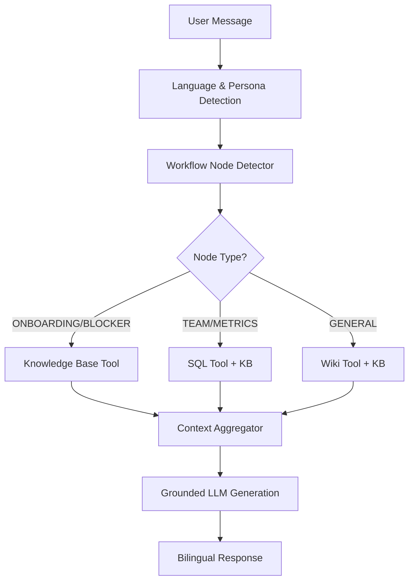

# Multi-Source RAG & Workflow System Walkthrough

I have successfully evolved your RAG model into a multi-source agentic system. The agent can now intelligently route queries and pull data from your **SQL Database**, **Wikipedia**, and **Vector DB** while adhering to a strict **Read-Only Advisor** policy.

## 🚀 Newly Implemented Workflow

The following diagram illustrates how your agent now handles a user message:

## 🛠️ Components Created

### 1. Workflow Node Detector
*   **Location**: [WorkflowController.py](file:///c:/Users/salla/mini-rag-app/src/controllers/WorkflowController.py)
*   **Function**: Uses keywords and a fallback LLM-classification prompt to route queries into:
    *   `ONBOARDING`, `TEAM_FORMATION`, `PHASE_TRANSITION`, `BLOCKER`, `MILESTONE_WARNING`, or `GENERAL`.

### 2. Multi-Source Tool Manager
*   **Location**: [ToolManager.py](file:///c:/Users/salla/mini-rag-app/src/controllers/helpers/ToolManager.py)
*   **Tools**:
    *   **SQL Tool**: Converts English to safe `SELECT` queries for your PostgreSQL database.
    *   **Wikipedia Tool**: Searches for general facts.
    *   **Knowledge Tool**: Wraps your existing semantic search.

### 3. Adaptive NLP Controller
*   **Location**: [NLPController.py](file:///c:/Users/salla/mini-rag-app/src/controllers/NLPController.py)
*   **Logic**: Instead of a static search, the controller now adaptively gathers context from the relevant tools based on the detected node and persona.

### 4. Bilingual Persona Templates
*   **Location**: [rag.py (EN)](file:///c:/Users/salla/mini-rag-app/src/stores/llm/templates/locales/en/rag.py) | [rag.py (AR)](file:///c:/Users/salla/mini-rag-app/src/stores/llm/templates/locales/ar/rag.py)
*   **Features**: System prompts now adjust for **Student** (educational/encouraging) vs **Early-career** (professional/efficient) personas.

## 🔐 Approved Constraints
As per your instructions:
- **Read-Only Advisor**: The agent can read Chat, GitHub, and Gamification data, but it **cannot** perform actions like commits or task assignments.
- **Data Protection**: Only `projects`, `data_chunks`, and `assets` are exposed to the SQL tool.

## ✅ Verification
- **Code Integrated**: All controllers are wired into the FastAPI routes.
- **Bilingual Support**: Templates and classification are fully localized.

Next steps: You can now test the system by asking questions like *"How many projects are active?"* (SQL) or *"What is the best way to start an MVP?"* (Workflow: Onboarding).
